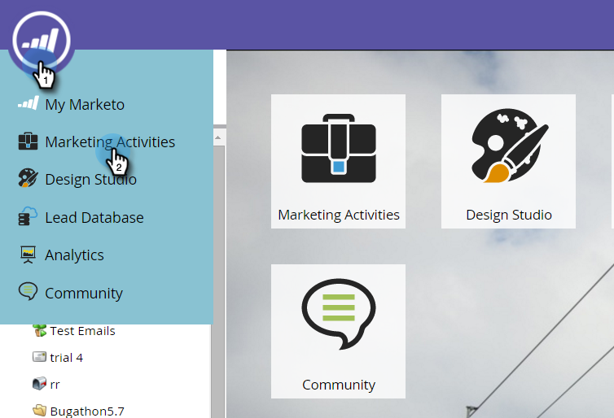

# Visualizzare il dashboard delle notifiche push {#view-the-push-notification-dashboard}

È facile vedere come funzionano le notifiche push.

1. Vai a **Attività di marketing** area.

   

1. Seleziona la campagna.

   

1. Clic **Visualizza: Riepilogo** e seleziona **Dashboard**.

   

1. Puoi visualizzare il totale inviato e il totale dei tocchi per iOS e Android in grafici a cerchi. Scorri verso il basso per visualizzare Tocca Decadimento nei grafici a barre.

   

   >[!NOTE]
   >
   >Il _Inviato_ La metrica può riflettere più invii rispetto al numero esatto di persone a cui è stata inviata la notifica push. Questo perché viene calcolato in base al *numero di dispositivi* che possono ricevere il messaggio push. Ad esempio, se una singola persona dispone di tre dispositivi, il dashboard registra tre invii, non uno.

   >[!MORELIKETHIS]
   >
   >* [Informazioni sulle notifiche push](/help/marketo/product-docs/mobile-marketing/push-notifications/understanding-push-notifications.md)
   >* [Inviare una notifica push per dispositivi mobili](/help/marketo/product-docs/mobile-marketing/push-notifications/send-a-mobile-push-notification.md)
