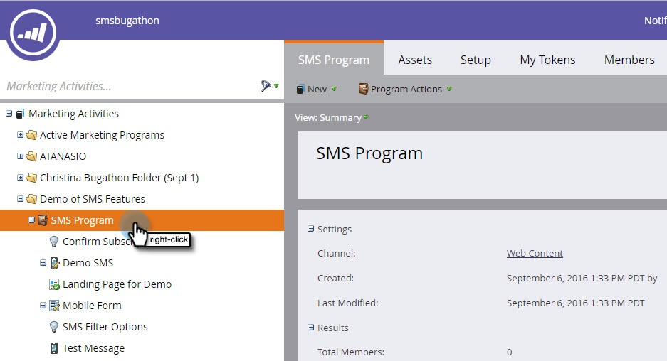

# Creare un messaggio SMS Vibes {#create-a-vibes-sms-message}

Ecco come creare un messaggio SMS Vibes.

>[!AVAILABILITY]
>
>Questa funzione è disponibile come componente aggiuntivo per il tuo account Marketo Engage. Affinché possa essere fornito correttamente, deve essere acquistato tramite Adobe. Contatta il tuo Adobe Customer Success Manager per maggiori dettagli.

>[!NOTE]
>
>La messaggistica di testo SMS non è compatibile con HIPAA.

1. Vai a **Attività di marketing** e fai clic con il pulsante destro del mouse su un programma.

   

1. Fai clic su **Nuova risorsa locale**.

   

   >[!TIP]
   >
   >In alternativa, puoi fare clic sul menu a discesa **Nuovo** .

1. Fai clic su **SMS Message**.

   

1. Immetti un nome e una descrizione facoltativa per il nuovo messaggio SMS e fai clic su **Crea**.

   

1. Fare clic su **Modifica bozza**.

   

1. Nell’editor dei messaggi, fai clic all’interno della bolla blu e inizia a inserire del testo.

   

   >[!NOTE]
   >
   >I limiti per gli Stati Uniti e il Canada sono diversi, rispettivamente a 160 e 130 caratteri. Se superi questi limiti di caratteri, il messaggio potrebbe essere suddiviso. Mentre ti mostriamo quando superi il limite canadese, l&#39;editor è ottimizzato per gli Stati Uniti e divide il messaggio in base al limite degli Stati Uniti.

1. Fai clic su **Token** nel menu Inserisci per aggiungere un token al messaggio.

   

   >[!NOTE]
   >
   >L’aggiunta di un token può causare il superamento del limite di caratteri del messaggio. Il messaggio verrà quindi suddiviso, con conseguente costo aggiuntivo.

1. Fai clic su **Collega** nel menu Inserisci per aggiungere un collegamento al messaggio.

   

1. Seleziona un tipo di collegamento. La pagina di destinazione Marketo è l’impostazione predefinita. Se si utilizza questa opzione, è necessario selezionare la pagina di destinazione dal menu a discesa e fare clic su **Inserisci**.

   

   >[!NOTE]
   >
   >I due collegamenti di tracciamento sono selezionati per impostazione predefinita.

1. Se invece desideri utilizzare un URL esterno, fai clic sul pulsante **External URL** e immetti l’URL nel campo URL. Fare clic su **Inserisci**.

   

1. Il collegamento viene visualizzato nel messaggio.

   

   >[!NOTE]
   >
   >Marketo visualizza un’anteprima del collegamento del dominio di tracciamento del brand. Se deselezioni la casella di controllo del collegamento mkt_tok, il collegamento viene modificato. Deseleziona anche la casella di controllo Track Link e l’URL verrà abbreviato in base alla lunghezza (ad esempio, www.mygooglepage.com).

   

   >[!NOTE]
   >
   >Il conteggio dei caratteri riflette solo i caratteri contenuti nel messaggio più basso.

Se inserisci più del limite USA, l&#39;editor suddivide il messaggio in sezioni. C&#39;è un limite totale assoluto di 900 caratteri. Una volta raggiunto tale limite, il messaggio viene troncato automaticamente quando viene inviato al relativo pubblico.
