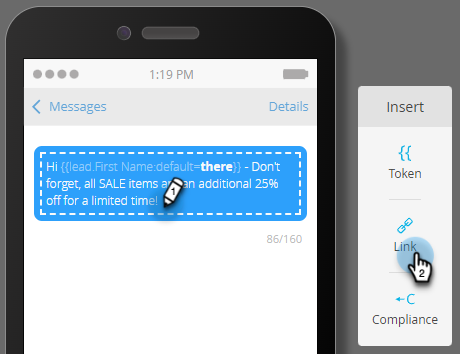

# Creare un messaggio SMS {#create-an-sms-message}

Ecco come creare un messaggio SMS.

>[!AVAILABILITY]
>
>Questa funzione è disponibile come componente aggiuntivo per il tuo account Adobe Marketo Engage. Per poter essere fornito correttamente, deve essere acquistato tramite Adobe. Per ulteriori informazioni, contatta il team dell’account di Adobe (il tuo Account Manager). L’integrazione nativa di Marketo Vibes SMS è disponibile negli Stati Uniti e in Canada. Per altri paesi, è possibile utilizzare una connessione tramite i webhook di Marketo contattando [direttamente Vibes](https://www.vibes.com/talk-to-sales).

>[!PREREQUISITES]
>
>[Aggiungi Vibes come servizio LaunchPoint](/help/marketo/product-docs/mobile-marketing/admin/add-vibes-as-a-launchpoint-service.md){target="_blank"}

1. Vai a **[!UICONTROL Marketing Activities]**.

   

1. Fare clic con il pulsante destro del mouse sul programma desiderato e selezionare **[!UICONTROL New Local Asset]**.

   

1. Seleziona **Messaggio SMS**.

   

1. Immettere un nome e una descrizione facoltativa per il nuovo messaggio SMS e fare clic su **Crea**.

   

1. Nell’editor, fai clic all’interno della bolla blu e inizia a immettere il testo.

   

   >[!NOTE]
   >
   >Il limite di caratteri per un messaggio SMS è di 160 caratteri utilizzando il set di caratteri ASCII standard. Se superi i 160 caratteri, il messaggio verrà suddiviso in base al numero totale di caratteri.

1. Per aggiungere un token al messaggio, scrivi un saluto e fai clic su **Token**.

   

   >[!NOTE]
   >
   >L’aggiunta di un token può causare il superamento del limite di caratteri per il messaggio. Il messaggio viene quindi suddiviso, creando un messaggio aggiuntivo.

   >[!IMPORTANT]
   >
   >Conformità SMS: tutti i messaggi SMS in uscita devono includere il nome del marchio o la descrizione del programma. Le istruzioni HELP e STOP devono essere fornite almeno una volta al mese per ogni abbonato ai programmi con messaggi ricorrenti.

1. Seleziona il **Token** desiderato, immetti un **Valore predefinito** facoltativo e fai clic su **Crea**.

   

1. Per aggiungere un collegamento, selezionare la posizione del messaggio che si desidera visualizzare e fare clic su **Collegamento**.

   

1. Seleziona un tipo di collegamento. Pagina di destinazione di Marketo è l’impostazione predefinita. Se si continua, fare clic sul menu a discesa Pagina di destinazione e selezionare la pagina desiderata. Al termine, fai clic su **Inserisci**.

   

   >[!NOTE]
   >
   >I due collegamenti di tracciamento sono selezionati per impostazione predefinita. Deselezionando Solo Includi mkt_tok sarà comunque possibile tenere traccia del collegamento, ma dopo il reindirizzamento l’URL di destinazione non includerà il parametro della stringa di query mkt_tok. Questo parametro viene utilizzato dalle pagine di destinazione di Marketo e da Munchkin per garantire il corretto tracciamento delle attività della persona (come quando una persona rinuncia).

1. Se invece si desidera utilizzare un URL esterno, selezionare **URL esterno**, immettere/incollare l&#39;URL e fare clic su **Inserisci**.

   

   >[!NOTE]
   >
   >Quando si mantiene selezionato &quot;Traccia collegamento&quot;, Marketo modifica automaticamente l’URL a scopo di tracciamento. Se si sceglie di disabilitare il tracciamento, l&#39;URL verrà visualizzato nel messaggio invariato (ad esempio, `www.adobe.com`).

   >[!CAUTION]
   >
   >Si consiglia di _non_ utilizzare abbreviazioni URL (ad esempio, Bits), in quanto i gestori potrebbero contrassegnare il messaggio come spam.

1. Il collegamento viene visualizzato nel messaggio.

   

   >[!NOTE]
   >
   >In Marketo viene visualizzata un’anteprima dei collegamenti del dominio di tracciamento del marchio. Se deselezionate la casella di controllo Collegamento mkt_tok (Market_tok link), il collegamento viene modificato.

Se inserisci più di 160 caratteri, l’editor suddivide l’SMS in sezioni. È previsto un limite complessivo di 900 caratteri per messaggio. Se superi questo limite, il messaggio verrà troncato alla consegna.
