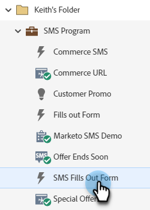

# Inviare un messaggio SMS {#send-a-vibes-sms-message}

Hai [ha creato il messaggio SMS](/help/marketo/product-docs/mobile-marketing/vibes-sms-messages/create-an-sms-message.md){target="_blank"}, ora è il momento di inviarlo. Puoi inviarlo tramite Batch o Trigger Campaign.

>[!NOTE]
>
>Durante l’invio di messaggi SMS:
>
>* Deduplicazione Marketo Engage per numero di telefono. Quindi, se più persone hanno lo stesso numero di telefono, solo una persona riceverà il messaggio se è membro di un solo elenco di abbonamenti Vibes. La deduplicazione viene eseguita a livello di elenco degli abbonamenti Vibes, non a livello di programma Marketo.
>* Marketo inserire nell&#39;elenco Bloccati non invierà a persone che sono state o Sospese dal marketing.
>* Un messaggio SMS non invierà a nessuno che ha annullato l’abbonamento se non è incluso nell’elenco del database mobile di Vibes.

## Inviare un SMS in batch {#send-a-batch-sms}

1. In Il mio Marketo, fai clic su **Attività di marketing**.

   

1. Trova e seleziona la campagna avanzata desiderata.

   

1. Fai clic su **Elenco avanzato** e definisci il pubblico per l’SMS. In questo esempio invieremo a tutti gli utenti del nostro Database la cui azienda è indicata come &quot;Adobe&quot;.

   

1. In **Flusso** , trascinare **Invia messaggio SMS**. Seleziona l’elenco Messaggi SMS e vibrazioni desiderato dai menu a discesa.

   

   >[!NOTE]
   >
   >Il selettore Elenco vibrazioni funge da ulteriore filtro per il pubblico già identificato nell’Elenco avanzato in modo da eseguire il targeting solo delle persone che appartengono a tale elenco.

1. Fai clic su **Pianificazione** e pianifica l’SMS.

   

## Invia un SMS di attivazione {#send-a-trigger-sms}

1. In Il mio Marketo, fai clic su **Attività di marketing**.

   

1. Trova e seleziona la campagna avanzata desiderata.

   

1. Fai clic su **Elenco avanzato** , selezionare il trigger desiderato e definirne il valore. In questo esempio utilizziamo **Compila modulo**.

   

1. In **Flusso** , trascinare **Invia messaggio SMS**. Seleziona l’elenco Messaggi SMS e vibrazioni desiderato dai menu a discesa.

   

   >[!NOTE]
   >
   >Il selettore Elenco vibrazioni funge da ulteriore filtro per il pubblico già identificato nell’Elenco avanzato in modo da eseguire il targeting solo delle persone che appartengono a tale elenco.

1. Fai clic su **Pianificazione** , quindi **Attiva**.

   

>[!MORELIKETHIS]
>
>* [Creare un messaggio vibrazioni](/help/marketo/product-docs/mobile-marketing/vibes-sms-messages/create-a-vibes-sms-message.md){target="_blank"}
>* [Utilizzo delle opzioni SMS in una campagna avanzata](/help/marketo/product-docs/mobile-marketing/vibes-sms-messages/using-sms-options-in-a-smart-campaign.md){target="_blank"}
