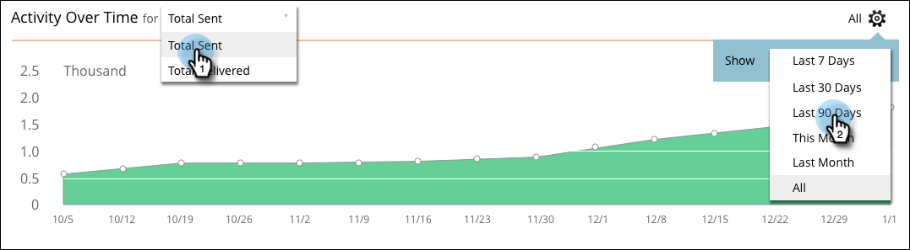

# Rapporti su SMS {#sms-reporting}

Il dashboard dei messaggi SMS fornisce utili analisi dei messaggi.

## Accedere al dashboard {#access-the-dashboard}

1. Per visualizzare i rapporti, seleziona il messaggio SMS desiderato. Fai clic sul menu a discesa **Visualizza** e seleziona **Dashboard**.

   

1. Verrà visualizzato il dashboard.

   

## Panoramica del dashboard {#dashboard-overview}

### Progressione SMS {#sms-progression}

Visualizza il totale inviato e il totale consegnato. Gli importi si trovano a destra e se passi il cursore sopra una barra, viene visualizzata la percentuale.

### Riepilogo {#summary}

Mostra il tasso di mancato recapito calcolato come percentuale. Passa il cursore del mouse sulla barra di inarcamento per visualizzare il tasso di consegna in base all’importo e alla percentuale. Passa il puntatore del mouse sulla sezione arancione della barra per visualizzare gli importi/percentuali dei tassi di mancato recapito morbidi e duri.

### Attività nel tempo {#activity-over-time}

Consente di selezionare Totale inviato o Totale recapitato. Seleziona un intervallo appropriato dal selettore dell’intervallo di date.

