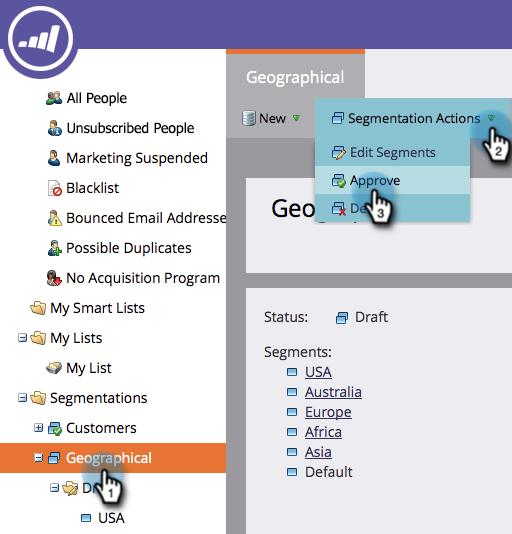

# Approvare una segmentazione {#approve-a-segmentation}

È necessario approvare una segmentazione prima di poterla utilizzare.

>[!PREREQUISITES]
>
>* [Creare una segmentazione](/help/marketo/product-docs/personalization/segmentation-and-snippets/segmentation/create-a-segmentation.md)
>* [Definire le regole di segmento](/help/marketo/product-docs/personalization/segmentation-and-snippets/segmentation/define-segment-rules.md)

>[!NOTE]
>
>È possibile approvare un massimo di 20 segmenti alla volta.

1. Vai a **Database**.

   

1. In Segmentazione fai clic su **Azioni di segmentazione** e quindi **Approva**.

   

   >[!NOTE]
   >
   >Lo stato cambia in Approvazione con ruota rotante ( ) durante l&#39;approvazione.

   >[!CAUTION]
   >
   >Il completamento dell&#39;approvazione può richiedere alcuni minuti o più di un giorno, a seconda delle dimensioni del database.

   Una volta approvato, lo stato cambia da Approvazione ad Approvato.
   

   >[!TIP]
   >
   >Il numero di persone in ciascun segmento viene visualizzato tra parentesi accanto al nome del segmento.

1. La **Persone** nella scheda **Segmento** ora mostra l’elenco finale delle persone per il segmento.

   

>[!CAUTION]
>
>Il numero totale di segmenti che puoi creare in una segmentazione dipende dal numero e dal tipo di filtri utilizzati e dalla complessità della logica dei segmenti. Anche se puoi creare fino a 100 segmenti utilizzando campi standard, l’utilizzo di altri tipi di filtri può aumentare la complessità e la segmentazione potrebbe non riuscire ad approvarla. Alcuni esempi sono: campi personalizzati, membro dell’elenco, campi del proprietario del lead e fasi di ricavo.
>
>Se ricevi un messaggio di errore durante l’approvazione e richiedi assistenza per ridurre la complessità della segmentazione, contatta [Supporto Marketo](https://nation.marketo.com/t5/Support/ct-p/Support).

>[!MORELIKETHIS]
>
>[Utilizzare i filtri dei segmenti in un elenco avanzato](/help/marketo/product-docs/personalization/segmentation-and-snippets/segmentation/use-segment-filters-in-a-smart-list.md)
