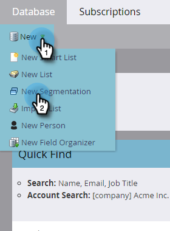
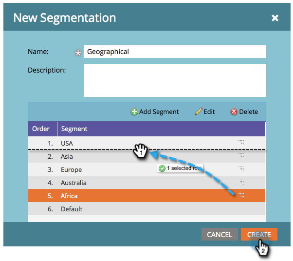

# Creare una segmentazione {#create-a-segmentation}

La segmentazione ti consente di raggruppare le persone in profili distinti per il reporting e il contenuto dinamico. Ecco come crearli.

1. Vai a **[!UICONTROL Database]**.

   

1. Fare clic su **[!UICONTROL New]** e quindi su **[!UICONTROL New Segmentation]**.

   

   >[!TIP]
   >
   >Puoi creare fino a 20 segmentazioni.

1. Immettere **[!UICONTROL Name]**, fare clic su **[!UICONTROL Add Segment]** e denominarlo.

   

   >[!NOTE]
   >
   >Impossibile spostare, modificare o eliminare il valore predefinito.

1. Aggiungi tutti i segmenti che desideri (fino a 100).

   

   >[!CAUTION]
   >
   >Il numero totale di segmenti che puoi creare in una segmentazione dipende dal numero e dal tipo di filtri utilizzati e anche dalla complessità della logica dei segmenti. Anche se è possibile creare fino a 100 segmenti utilizzando campi standard, l’utilizzo di altri tipi di filtri può aumentare la complessità e la segmentazione potrebbe non essere approvata. Alcuni esempi sono: campi personalizzati, membri di un elenco, campi del proprietario del lead e fasi dei ricavi.
   >
   >Se ricevi un messaggio di errore durante l&#39;approvazione e hai bisogno di assistenza per ridurre la complessità della segmentazione, contatta il [supporto Marketo](https://nation.marketo.com/t5/support/ct-p/Support).

1. Trascina e rilascia i segmenti per modificarne l’ordine. Al termine, fai clic su **[!UICONTROL Create]**.

   

   >[!NOTE]
   >
   >Una persona sarà idonea per il primo segmento corrispondente nell&#39;[ordine](/help/marketo/product-docs/personalization/segmentation-and-snippets/segmentation/segmentation-order-priority.md) definito.

   >[!NOTE]
   >
   >È necessario definire le regole del segmento prima di poter utilizzare la segmentazione.

   Congratulazioni! Sei a un passo dall’utilizzo dei contenuti dinamici.

   >[!MORELIKETHIS]
   >
   >[Definisci regole segmento](/help/marketo/product-docs/personalization/segmentation-and-snippets/segmentation/define-segment-rules.md)
