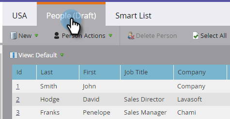
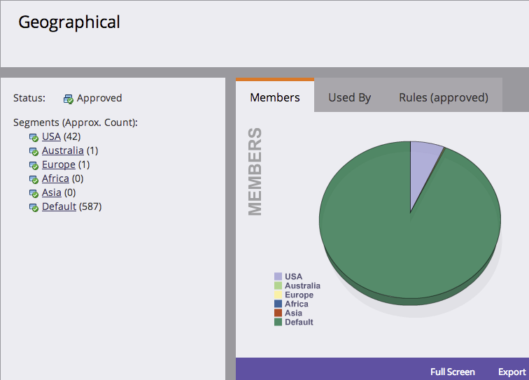

# Definire le regole del segmento {#define-segment-rules}

La definizione delle regole di segmento consente di categorizzare le persone in gruppi diversi che si escludono a vicenda.

>[!PREREQUISITES]
>
>[Crea una segmentazione](/help/marketo/product-docs/personalization/segmentation-and-snippets/segmentation/create-a-segmentation.md)

1. Passare a **[!UICONTROL Database]**.

   

1. Seleziona **[!UICONTROL Segmentations]** dalla struttura, quindi fai clic su un particolare **Segmento**.

   

1. Fare clic su **[!UICONTROL Smart List]** e aggiungere i filtri.

   

   >[!CAUTION]
   >
   >I segmenti al momento non supportano gli operatori _Nel passato_ e _Nel periodo di tempo_ nei filtri. Questo perché le segmentazioni verificano la disponibilità di aggiornamenti solo quando viene registrato un valore di dati di modifica. Questi valori sono _non_ registrati per elementi che vengono modificati automaticamente, ad esempio campi formula e date. Inoltre, gli operatori di date con intervalli di date relativi non sono supportati in quanto vengono calcolati al momento dell’approvazione della segmentazione e non al momento di un’attività Modifica valore dati.

   >[!NOTE]
   >
   >I filtri &quot;SFDC Type&quot; e &quot;Microsoft Type&quot; non sono attualmente supportati negli elenchi avanzati di segmentazione.

1. Inserisci i valori appropriati per i filtri.

   

   >[!CAUTION]
   >
   >Il comportamento di registrazione delle attività per i campi Account può influire sulla qualifica. Pertanto, consigliamo di non utilizzare i campi Account durante la definizione delle regole del segmento.

1. Fare clic sulla scheda **[!UICONTROL People (Draft)]** per visualizzare le persone idonee per essere membri di questo segmento.

   

1. Passa a **[!UICONTROL Segmentation Actions]**. Fai clic su **[!UICONTROL Approve]**.

   

   >[!CAUTION]
   >
   >Il numero totale di segmenti che puoi creare in una segmentazione dipende dal numero e dal tipo di filtri utilizzati e anche dalla complessità della logica dei segmenti. Anche se è possibile creare fino a 100 segmenti utilizzando campi standard, l’utilizzo di altri tipi di filtri può aumentare la complessità e la segmentazione potrebbe non essere approvata. Alcuni esempi sono: campi personalizzati, membri di un elenco, campi del proprietario del lead e fasi dei ricavi.
   >
   >Se ricevi un messaggio di errore durante l&#39;approvazione e hai bisogno di assistenza per ridurre la complessità della segmentazione, contatta il [supporto Marketo](https://nation.marketo.com/t5/support/ct-p/Support).

1. Consulta la dashboard per una panoramica rapida dei segmenti in un grafico a torta, nonché delle regole applicate.

   

Ottimo lavoro! Questi segmenti diventeranno utili in molti posti in Marketo.

>[!NOTE]
>
>Una persona può qualificarsi per segmenti diversi, ma alla fine appartiene a uno solo che dipende dall&#39;[ordine di priorità dei segmenti](/help/marketo/product-docs/personalization/segmentation-and-snippets/segmentation/segmentation-order-priority.md).

>[!NOTE]
>
>La schermata [!UICONTROL People (Draft)] mostra tutte le persone idonee per essere membro e non è sempre l&#39;elenco finale delle persone. Approva il segmento per visualizzare l’elenco finale.

>[!MORELIKETHIS]
>
>[Approva una segmentazione](/help/marketo/product-docs/personalization/segmentation-and-snippets/segmentation/approve-a-segmentation.md)
