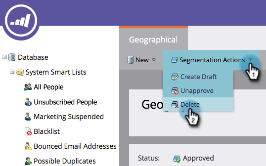

# Eliminare una segmentazione {#delete-a-segmentation}

Per eliminare una segmentazione, segui i passaggi indicati di seguito.

1. Passare a **[!UICONTROL Database]**.

   

1. Vai alla tua segmentazione e fai clic su **[!UICONTROL Used By]** per controllare le associazioni.

   

   Se la segmentazione viene utilizzata da altre risorse, rimuovi tutte queste associazioni prima di procedere.

1. Rimuovere tutte le associazioni, quindi in **[!UICONTROL Segmentation Actions]** fare clic su **[!UICONTROL Unapprove]**.

   

   >[!NOTE]
   >
   >Per rimuovere le associazioni, elimina o crea delle alternative per le risorse che utilizzano la segmentazione.

1. Una volta non approvata, fai clic su **[!UICONTROL Segmentation Actions]** e [!UICONTROL Delete] la segmentazione.

   
