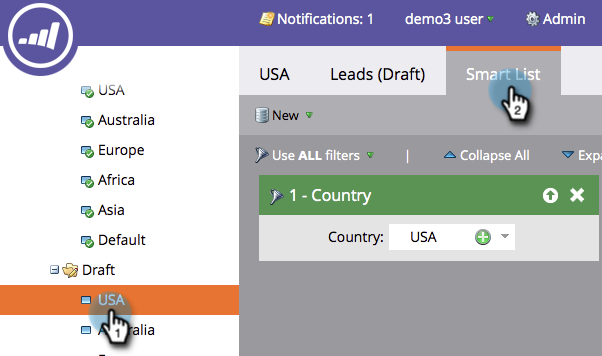

# Modificare una segmentazione {#edit-a-segmentation}

Apportare modifiche alle segmentazioni esistenti è semplice. Ecco la parte bassa.

## Creare una bozza di segmentazione {#create-a-segmentation-draft}

1. Passare a **[!UICONTROL Database]**.

   

1. Nella segmentazione, fai clic su **[!UICONTROL Segmentation Actions]** e quindi su **[!UICONTROL Create Draft]**.

   

1. **[!UICONTROL Status]** diventa [!UICONTROL Approved with Draft]. Nella segmentazione viene creata una cartella **[!UICONTROL Draft]**.

   

## Aggiungere, modificare o eliminare segmenti {#add-edit-or-delete-segments}

1. Nella segmentazione, fai clic su **[!UICONTROL Segmentation Actions]** e quindi su **[!UICONTROL Edit Segments]**.

   

   >[!NOTE]
   >
   >È possibile modificare solo i segmenti di un [!UICONTROL Draft] e non la segmentazione approvata.

1. **[!UICONTROL Add Segment]**, **[!UICONTROL Edit]** esistenti (rinominare o modificare l&#39;ordine) o **[!UICONTROL Delete]** segmenti.

   

   >[!NOTE]
   >
   >È necessario selezionare un segmento prima di modificarlo o eliminarlo.

   >[!CAUTION]
   >
   >L’eliminazione influisce su tutti i contenuti dinamici associati nelle e-mail, nelle pagine di destinazione e nei frammenti. **Nessun annullamento**. Controlla la scheda **[!UICONTROL Used By]** per vedere cosa utilizza quel segmento.

## Modifica regole segmento {#edit-segment-rules}

1. Nel [!UICONTROL Draft] **Segmento**, passa a **[!UICONTROL Smart List]**. Applica regole simili a [Definizione delle regole del segmento](/help/marketo/product-docs/personalization/segmentation-and-snippets/segmentation/define-segment-rules.md).

   

   >[!NOTE]
   >
   >Non puoi modificare i Segmenti approvati. Fare clic su Segmenti nella cartella [!UICONTROL Draft] per modificarli.

   >[!NOTE]
   >
   >Ricorda di approvare la bozza di segmentazione.

Puoi provare le segmentazioni non utilizzate nel contenuto dinamico.

>[!MORELIKETHIS]
>
>[Eliminare una segmentazione](/help/marketo/product-docs/personalization/segmentation-and-snippets/segmentation/delete-a-segmentation.md)
