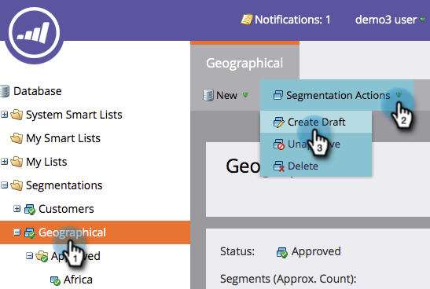

# Modifica di una segmentazione {#edit-a-segmentation}

È facile apportare modifiche alle segmentazioni esistenti. Ecco il basso.

## Creare una bozza di segmentazione {#create-a-segmentation-draft}

1. Vai al **database**.

   

1. Nella segmentazione, fai clic su Azioni **di** segmentazione, quindi su **Crea bozza**.

   

1. Il **Status **cambia in Approvato con Bozza. Nella segmentazione viene creata una cartella **Draft **6.

   

## Aggiunta, modifica o eliminazione di segmenti {#add-edit-or-delete-segments}

1. Nella segmentazione, fai clic su Azioni **di** segmentazione, quindi su **Modifica segmenti**.

   

   >[!NOTE]
   >
   >È possibile modificare solo i segmenti di una bozza e non la segmentazione approvata.

1. **Aggiungi segmento**, **Modifica **esistente (rinominare o modificare l&#39;ordine) o **Elimina **tutti i segmenti.

   

   >[!NOTE]
   >
   >È necessario selezionare un segmento prima di poterlo modificare o eliminare.

   >[!CAUTION]
   >
   >L’eliminazione interessa tutti i contenuti dinamici associati nelle e-mail, nelle pagine di destinazione e negli snippet. **Non è possibile annullare**. Per vedere cosa utilizza quel segmento, selezionate la scheda **Usato da** .

## Modifica regole segmento {#edit-segment-rules}

1. Nel **segmento** bozza, passate a Elenco **** avanzato. Applicare regole simili a [Definizione delle regole](http://docs.marketo.com/display/public/DOCS/Define+Segment+Rules)di segmento.

   

   >[!NOTE]
   >
   >Non puoi modificare i segmenti approvati. Fate clic su Segmenti nella cartella Bozza per modificarli.

   >[!NOTE]
   >
   >**Promemoria**
   >
   >
   >Ricorda di approvare la bozza di segmentazione.

Potete sperimentare le segmentazioni non utilizzate nel contenuto dinamico.

>[!MORELIKETHIS]
>
>* [Eliminazione di una segmentazione](delete-a-segmentation.md)

>

