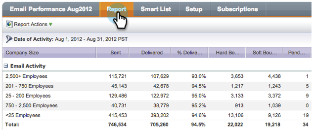

# Raggruppare rapporti e-mail per segmentazioni {#group-email-reports-by-segmentations}

Le segmentazioni non sono solo per il contenuto dinamico. Puoi anche raggruppare il rapporto sulle prestazioni delle e-mail per segmentazioni.

>[!PREREQUISITES]
>
>[Approva una segmentazione](/help/marketo/product-docs/personalization/segmentation-and-snippets/segmentation/approve-a-segmentation.md)

1. Passare all&#39;area **[!UICONTROL Marketing Activities]** (o **[!UICONTROL Analytics]**).

   

1. Seleziona il tuo report **[!UICONTROL Email Performance]**.

   

1. Fai clic sulla scheda **[!UICONTROL Setup]** e trascina su **[!UICONTROL Group by Segmentations]**.

   

1. Scegli una o due segmentazioni da utilizzare per raggruppare il rapporto. Fai clic su **[!UICONTROL Apply]**.

   

1. Fai clic sulla scheda **[!UICONTROL Report]**. Se utilizzi una segmentazione, il rapporto mostra una riga per ogni segmento.

   

1. Se utilizzi due segmentazioni, viene visualizzata una riga per ogni _combinazione_ di segmenti.

   

>[!MORELIKETHIS]
>
>[Filtrare Assets in un report e-mail](/help/marketo/product-docs/reporting/basic-reporting/report-activity/filter-assets-in-an-email-report.md)
