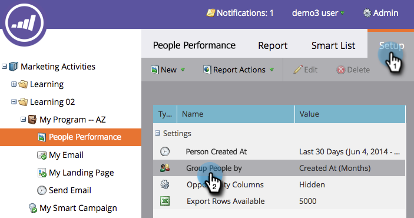

# Rapporti sulla persona del gruppo per segmento {#group-person-reports-by-segment}

Potete raggruppare i rapporti personali in base a qualsiasi segmento definito nelle segmentazioni.

1. Andate alla sezione **Marketing Activities** (o **Analytics**).

   

1. Selezionate il rapporto sulla persona dalla struttura di navigazione.

   

1. Fare clic sulla scheda **Configurazione** e fare doppio clic su **Raggruppa persone per**.

   

   >[!NOTE]
   >
   >È inoltre possibile [raggruppare i rapporti personali per persona o per attributo della società](/help/marketo/product-docs/reporting/basic-reporting/report-activity/group-person-reports-by-attribute.md).

1. Nella finestra di dialogo **Raggruppa persone per**, iniziate a digitare Segmentazione nella casella di testo. Quando viene visualizzata l&#39;intestazione **Segmentazioni**, selezionarne una dall&#39;elenco al di sotto dell&#39;intestazione.

   

1. Fare clic sulla scheda **Report** per visualizzare il rapporto raggruppato per il segmento selezionato.

   

>[!MORELIKETHIS]
>
>[Aggiunta di colonne personalizzate a un report di persona](/help/marketo/product-docs/reporting/basic-reporting/editing-reports/add-custom-columns-to-a-person-report.md)
