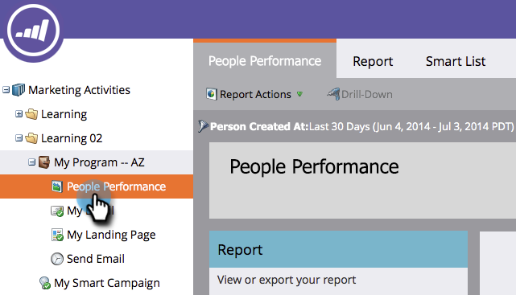
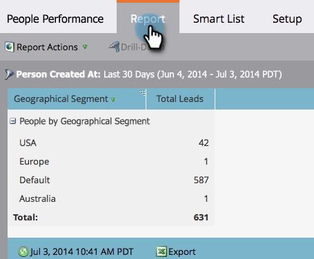

# Raggruppare rapporti persona per segmento {#group-person-reports-by-segment}

Puoi raggruppare i rapporti sulle persone in base a qualsiasi segmento definito nelle segmentazioni.

1. Passare alla sezione **[!UICONTROL Marketing Activities]** (o **[!UICONTROL Analytics]**).

   

1. Seleziona il rapporto della persona dalla struttura di navigazione.

   

1. Fare clic sulla scheda **[!UICONTROL Setup]** e fare doppio clic su **[!UICONTROL Group People by]**.

   

   >[!NOTE]
   >
   >Puoi anche [raggruppare i rapporti sulle persone per attributo della persona o dell&#39;azienda](/help/marketo/product-docs/reporting/basic-reporting/report-activity/group-person-reports-by-attribute.md).

1. Nella finestra di dialogo **[!UICONTROL Group People by]**, inizia a digitare &#39;Segmentation&#39; nella casella di testo. Quando viene visualizzata l&#39;intestazione **Segmentations**, selezionane una dall&#39;elenco sotto l&#39;intestazione.

   

1. Fare clic sulla scheda **[!UICONTROL Report]** per visualizzare il report raggruppato per il segmento selezionato.

   

>[!MORELIKETHIS]
>
>[Aggiungere colonne personalizzate a un report persona](/help/marketo/product-docs/reporting/basic-reporting/editing-reports/add-custom-columns-to-a-person-report.md)
