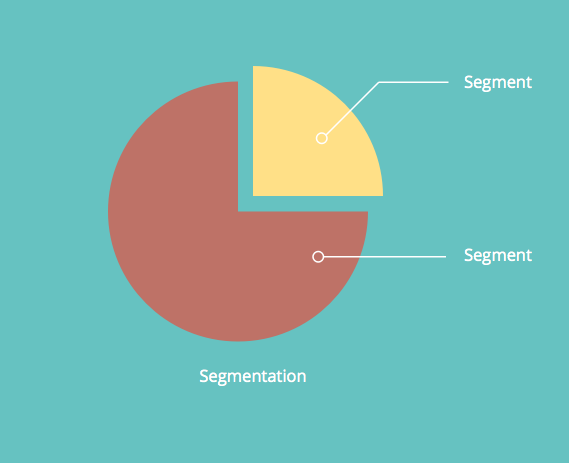

# Informazioni sui contenuti dinamici {#understanding-dynamic-content}

La personalizzazione offre molto di più di un semplice saluto `{{First_Name}}`&quot;. Con il contenuto dinamico Marketo, puoi personalizzare il modo in cui persone diverse visualizzano una pagina di destinazione o un’e-mail.

## Segmentazione {#segmentation}

Innanzitutto, devi dividere il tuo popolo in sottogruppi. Questo è chiamato [segmentazione](/help/marketo/product-docs/personalization/segmentation-and-snippets/segmentation/create-a-segmentation.md).

>[!NOTE]
>
>**Definizione**
>
>La segmentazione classifica il pubblico in diversi sottogruppi in base a una [Elenco avanzato](/help/marketo/product-docs/core-marketo-concepts/smart-campaigns/understanding-smart-campaigns.md) regola. Questi gruppi sono denominati segmenti.

Ad esempio, se abbiamo una segmentazione chiamata Industria, alcuni dei segmenti potrebbero essere: Sanità, Tecnologia, Finanza, Beni di consumo, ecc.

## Contenuto dinamico {#dynamic-content}

Dopo aver creato segmenti diversi, puoi aggiungere blocchi di contenuto dinamici nella pagina di destinazione o nell’e-mail. Questo comunica a Marketo che desideri che l’elemento di contenuto sia diverso a seconda di quale persona lo visualizzi.

## Snippet {#snippets}

[Snippet](/help/marketo/product-docs/personalization/segmentation-and-snippets/snippets/create-a-snippet.md) sono uno strumento utile in Marketo. Creala una volta e usala in più posizioni! Se aggiorni il frammento di codice, tutte le risorse (pagine di destinazione o e-mail) che lo utilizzano verranno aggiornate automaticamente.

>[!NOTE]
>
>**Esempio**
>
>* È possibile utilizzare uno snippet come firma in un messaggio e-mail. Modifica dinamica del testo a seconda della posizione del destinatario.
>* Sulle pagine di destinazione, dispone di un’area di invito all’azione standard con collegamenti diversi per i clienti potenziali e potenziali. Aggiorna centinaia di LP a livello centrale.

Provatelo e raccontateci la vostra storia di successo!

>[!MORELIKETHIS]
>
>* [Creare una segmentazione](/help/marketo/product-docs/personalization/segmentation-and-snippets/segmentation/create-a-segmentation.md)
>* [Creare uno snippet](/help/marketo/product-docs/personalization/segmentation-and-snippets/snippets/create-a-snippet.md)
