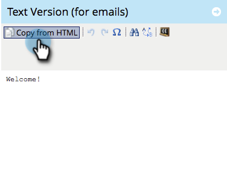

# Aggiungere contenuto a un frammento {#add-content-to-a-snippet}

>[!PREREQUISITES]
>
>[Creare un frammento](/help/marketo/product-docs/personalization/segmentation-and-snippets/snippets/create-a-snippet.md)

È possibile aggiungere token, immagini, file o testo RTF a uno snippet.

>[!NOTE]
>
>Non è possibile incorporare alcun [Sintassi e-mail Marketo](/help/marketo/product-docs/email-marketing/general/email-editor-2/email-template-syntax.md) in frammenti; sarà **not** lavora in un’e-mail. Gli snippet devono essere costituiti solo da contenuto corpo (HTML + TESTO).

1. Vai a **Design Studio**.

   

1. Seleziona la tua **Frammento** e fai clic su **Modifica bozza**.

   

È possibile aggiungere tre tipi di contenuto a uno snippet.

## Aggiungi token {#add-token}

1. Trascina e rilascia la **Token** elemento.

   

1. Invio **Token** e fai clic su **Inserisci**.

   

## Aggiungi immagine/file {#add-image-file}

1. Trascina e rilascia la **Immagine/File** elemento.

   

   >[!NOTE]
   >
   >Puoi aggiungere immagini o file personalizzati a Marketo. Ulteriori informazioni [immagini e file](/help/marketo/product-docs/demand-generation/images-and-files/add-images-and-files-to-marketo.md).

1. Seleziona la **Immagine** da utilizzare e fai clic su **Inserisci**.

   

   >[!NOTE]
   >
   >Puoi anche cercare un’immagine specifica se ne conosci il nome.

## Aggiungi testo {#add-text}

1. Digitare l’area Versione di HTML per aggiungere testo.

   

   >[!TIP]
   >
   >Utilizzare gli strumenti di formattazione per personalizzare il testo.

1. Per E-mail, fai clic sul pulsante **Versione testo** scheda .

   

1. Fai clic su **Copia da HTML**.

   

   >[!NOTE]
   >
   >Le immagini, i collegamenti e la formattazione vengono rimossi nella versione di testo.

Calmo! Ora è possibile creare una varietà di contenuti per il tuo Snippet.

>[!MORELIKETHIS]
>
>* [Anteprima di un frammento](/help/marketo/product-docs/personalization/segmentation-and-snippets/snippets/preview-a-snippet.md)
>* [Approvare un frammento](/help/marketo/product-docs/personalization/segmentation-and-snippets/snippets/approve-a-snippet.md)

