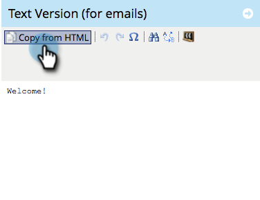

# Aggiungere contenuto a uno snippet {#add-content-to-a-snippet}

>[!PREREQUISITES]
>
>[Crea snippet](/help/marketo/product-docs/personalization/segmentation-and-snippets/snippets/create-a-snippet.md)

È possibile aggiungere token, immagini, file o testo RTF a uno snippet.

>[!NOTE]
>
>Impossibile incorporare [sintassi e-mail di Marketo](/help/marketo/product-docs/email-marketing/general/email-editor-2/email-template-syntax.md) nei frammenti. **non** funzionerà in un messaggio e-mail. I frammenti devono essere solo contenuto del corpo (HTML + TESTO).

1. Passare a **[!UICONTROL Design Studio]**.

   

1. Seleziona il **frammento** e fai clic su **[!UICONTROL Edit Draft]**.

   

È possibile aggiungere tre tipi di contenuto a uno snippet.

## Aggiungi [!UICONTROL Token] {#add-token}

1. Trascina e rilascia l&#39;elemento **[!UICONTROL Token]**.

   

1. Immettere **[!UICONTROL Token]** e fare clic su **[!UICONTROL Insert]**.

   

## Aggiungi immagine/file {#add-image-file}

1. Trascina e rilascia l&#39;elemento **[!UICONTROL Image/File]**.

   

   >[!NOTE]
   >
   >È possibile aggiungere immagini o file personalizzati a Marketo. Ulteriori informazioni su [immagini e file](/help/marketo/product-docs/demand-generation/images-and-files/add-images-and-files-to-marketo.md).

1. Selezionare l&#39;**immagine** da utilizzare e fare clic su **[!UICONTROL Insert]**.

   

   >[!NOTE]
   >
   >Puoi anche cercare un’immagine specifica se ne conosci il nome.

## Aggiungi testo {#add-text}

1. Digitare nell&#39;area Versione di HTML per aggiungere testo.

   

   >[!TIP]
   >
   >Utilizzare gli strumenti di formattazione per personalizzare il testo.

1. Per le e-mail, fare clic sulla scheda **[!UICONTROL Text Version (for emails)]**.

   

1. Fai clic su **[!UICONTROL Copy from HTML]**.

   

   >[!NOTE]
   >
   >Le immagini, i collegamenti e la formattazione vengono rimossi nella versione testo.

Fantastico! Ora è possibile creare una varietà di contenuti per lo snippet.

>[!MORELIKETHIS]
>
>* [Anteprima di uno snippet](/help/marketo/product-docs/personalization/segmentation-and-snippets/snippets/preview-a-snippet.md)
>* [Approva snippet](/help/marketo/product-docs/personalization/segmentation-and-snippets/snippets/approve-a-snippet.md)
