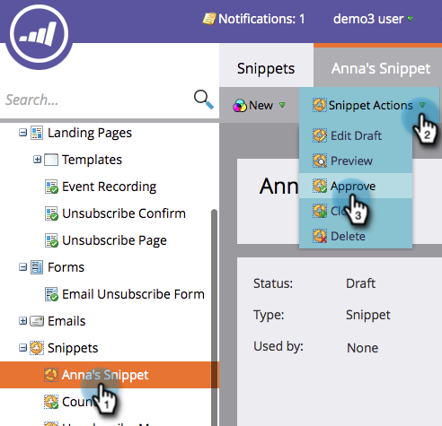

# Approvare uno snippet {#approve-a-snippet}

>[!PREREQUISITES]
>
>[Aggiungi contenuto a frammento](/help/marketo/product-docs/personalization/segmentation-and-snippets/snippets/add-content-to-a-snippet.md)

Uno snippet deve essere approvato prima dell&#39;uso.

1. Passare a **[!UICONTROL Design Studio]**.

   

1. Fai clic sul **frammento**. In **[!UICONTROL Snippet Actions]**, fare clic su **[!UICONTROL Approve]**.

   

Tutto qui. Lo stato del frammento cambia da Bozza ad Approvato.

>[!MORELIKETHIS]
>
>[Approva frammento senza bozza](/help/marketo/product-docs/personalization/segmentation-and-snippets/snippets/approve-a-snippet-with-no-draft.md)
