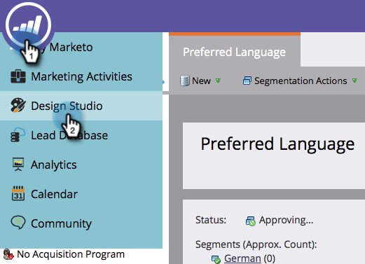

# Duplica uno snippet {#clone-a-snippet}

Clonate uno snippet per crearne una copia da modificare in base alle vostre esigenze.

1. Andate a **Design Studio**.

   

1. Accedete allo snippet e, in **Azioni snippet**, fate clic su **Clone**.

   

1. Inserite i dettagli del frammento e fate clic su **Clone**.

   

Fantastico! Ora puoi modificare il frammento clonato in base alle tue esigenze.

>[!MORELIKETHIS]
>
>[Modificare gli snippet con il contenuto dinamico](/help/marketo/product-docs/personalization/segmentation-and-snippets/snippets/edit-snippets-with-dynamic-content.md)
