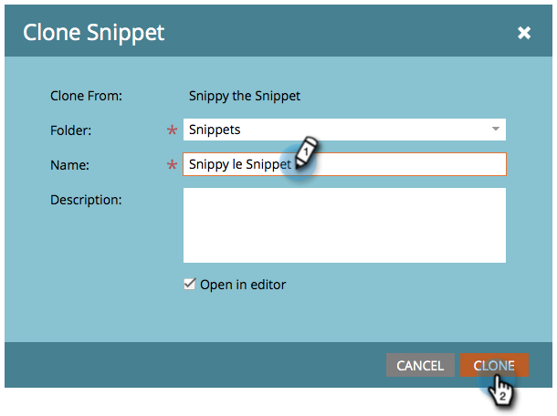

# Clona un frammento {#clone-a-snippet}

Clona un frammento per crearne una copia che puoi modificare in base alle tue esigenze.

1. Vai a **Design Studio**.

   

1. Vai al tuo Snippet e poi sotto **Azioni frammento**, fai clic su **Clona**.

   

1. Immetti i dettagli del frammento e fai clic su **Clona**.

   

Fantastico! Ora puoi modificare il frammento clonato in base alle tue esigenze.

>[!MORELIKETHIS]
>
>[Modificare i frammenti con il contenuto dinamico](/help/marketo/product-docs/personalization/segmentation-and-snippets/snippets/edit-snippets-with-dynamic-content.md)
