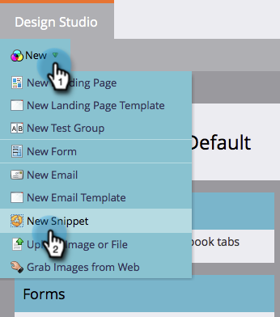

# Creare uno snippet {#create-a-snippet}

Gli snippet possono essere utilizzati come blocchi di contenuto dinamici nelle **e-mail** e **pagine di destinazione**.

1. Vai a **Design Studio.**

   

1. Fare clic su **Nuovo**, quindi su **Nuovo snippet**.

   

1. Inserite i dettagli richiesti e fate clic su **Crea**.

   

Ottimo lavoro! Semplificate il lavoro creando snippet per il contenuto dinamico. Ora puoi procedere e [aggiungere contenuti al nuovo snippet](/help/marketo/product-docs/personalization/segmentation-and-snippets/snippets/add-content-to-a-snippet.md).

>[!MORELIKETHIS]
>
>* [Aggiunta di contenuto a uno snippet](/help/marketo/product-docs/personalization/segmentation-and-snippets/snippets/add-content-to-a-snippet.md)
>* [Informazioni sui contenuti dinamici](/help/marketo/product-docs/personalization/segmentation-and-snippets/segmentation/understanding-dynamic-content.md)

