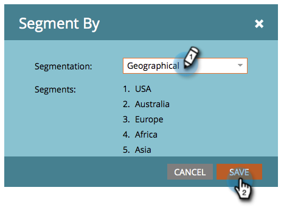
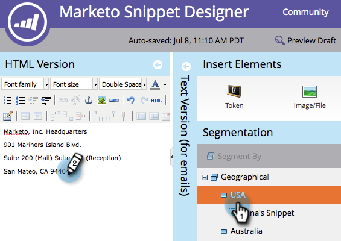

# Modificare snippet con contenuto dinamico {#edit-snippets-with-dynamic-content}

>[!PREREQUISITES]
>
>* [Crea una segmentazione](/help/marketo/product-docs/personalization/segmentation-and-snippets/segmentation/create-a-segmentation.md)
>* [Crea snippet](/help/marketo/product-docs/personalization/segmentation-and-snippets/snippets/create-a-snippet.md)

Utilizza la segmentazione in snippet per gestire facilmente il contenuto dinamico sulle e-mail e sulle pagine di destinazione.

## Aggiungi segmentazione {#add-segmentation}

1. Passare a **[!UICONTROL Design Studio]**.

   

1. Fai clic sul **frammento** e quindi su **[!UICONTROL Edit Draft]**.

   

1. Fai clic su **[!UICONTROL Segment By]**.

   

1. Immetti **[!UICONTROL Segmentation]** e fai clic su **[!UICONTROL Save]**.

   

## Applicare contenuti dinamici {#apply-dynamic-content}

1. Fai clic su un **segmento** e quindi modifica il contenuto. Ripeti per ogni segmento

   

>[!NOTE]
>
>Ricordati di approvare il frammento prima di utilizzarlo.

Non era semplice? Ora tutti potete utilizzare questi snippet nelle e-mail e nelle pagine di destinazione.

>[!MORELIKETHIS]
>
>* [Aggiungere uno snippet a un messaggio e-mail](/help/marketo/product-docs/email-marketing/general/functions-in-the-editor/add-a-snippet-to-an-email.md)
>* [Aggiungere uno snippet a una pagina di destinazione](/help/marketo/product-docs/demand-generation/landing-pages/personalizing-landing-pages/add-a-snippet-to-a-landing-page.md)
