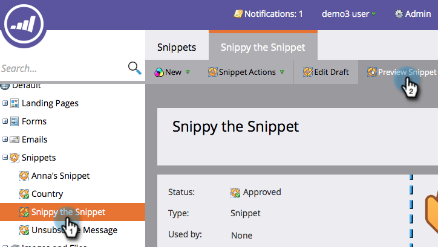

# Anteprima di uno snippet {#preview-a-snippet}

>[!PREREQUISITES]
>
>[Aggiungi contenuto a frammento](/help/marketo/product-docs/personalization/segmentation-and-snippets/snippets/add-content-to-a-snippet.md)

I frammenti sono blocchi di contenuto dinamico che cambiano in base alle regole di segmentazione.

1. Passare a **[!UICONTROL Design Studio]**.

   

1. Fai clic sul frammento e quindi **[!UICONTROL Preview Snippet]**.

   

L’anteprima è utile per assicurarti che il contenuto sia visualizzato correttamente per ogni segmento.

>[!MORELIKETHIS]
>
>[Approva snippet](/help/marketo/product-docs/personalization/segmentation-and-snippets/snippets/approve-a-snippet.md)
