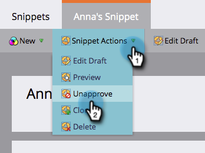

# Annullare l’approvazione di un frammento {#unapprove-a-snippet}

Uno snippet non approvato non può essere utilizzato nelle e-mail o nelle pagine di destinazione.

1. Vai a **Design Studio**.

   

1. Vai al tuo Snippet e assicurati che non sia **Utilizzato da** qualsiasi risorsa.

   

   Se lo snippet viene utilizzato da altre risorse, rimuovi queste associazioni prima di procedere.

1. In **Azioni frammento**, fai clic su **Annulla approvazione**.

   

Tutto qui! Lo snippet è in stato di bozza ora per poter apportare modifiche o eliminarlo.
