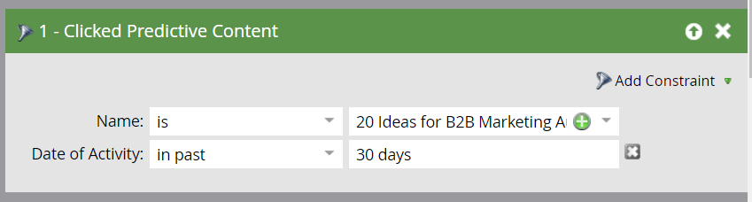

# Definire un elenco avanzato per le attività relative ai contenuti predittivi {#define-a-smart-list-for-predictive-content-activities}

Potete utilizzare le attività di contenuto predittivo in attivatori e filtri quando definite un elenco smart in una campagna intelligente. È possibile attivare un&#39;azione per chiunque faccia clic sul contenuto predittivo tramite il [modello di contenuti multimediali avanzati](/help/marketo/product-docs/predictive-content/enabling-predictive-content/enable-predictive-content-for-web-rich-media.md), la [barra delle raccomandazioni sui contenuti](/help/marketo/product-docs/predictive-content/enabling-predictive-content/enable-the-content-recommendation-bar.md) o in un [messaggio e-mail](/help/marketo/product-docs/predictive-content/enabling-predictive-content/enable-predictive-content-in-emails.md).

1. Nella campagna intelligente, andate alla scheda **Smart List**.

   

   >[!NOTE]
   >
   >Gli elenchi intelligenti possono fare cose straordinarie. Per saperne di più, consulta la sezione [smart list deep dive](/help/marketo/product-docs/core-marketo-concepts/smart-campaigns/understanding-smart-campaigns.md).

1. Cercare l&#39;attivatore, quindi trascinarlo e rilasciarlo sul quadro.

   

   >[!NOTE]
   >
   >Una campagna intelligente con trigger viene eseguita in modalità Trigger. Viene eseguito su una persona alla volta in base agli eventi attivati e ai filtri aggiunti.

1. Fare clic sul menu a discesa **Nome** e selezionare un operatore.

   

1. Definire il trigger.

   

1. Aggiungete il vincolo **Type**.

   

1. Selezionare l&#39;origine desiderata per l&#39;elenco avanzato.

   

1. Se utilizzate l&#39;origine e-mail per il contenuto predittivo, aggiungete il trigger **Clic su Collega in E-mail**. Selezionate l&#39;e-mail e aggiungete il vincolo **Predictive**, definito come **true**.

   

1. Aggiungete eventuali altri filtri in base alle esigenze.

   

   >[!TIP]
   >
   >In una campagna intelligente con attivatori e filtri, i trigger si trovano nella parte superiore. Quando viene attivato, solo gli utenti che soddisfano i criteri del filtro passano attraverso il flusso.

   >[!NOTE]
   >
   >Con più attivatori, una persona passa al flusso se QUALSIASI attivatore viene attivato.

   Per eseguire la campagna su un insieme di persone allo stesso tempo, imparare a [definire un elenco smart per una campagna batch intelligente](/help/marketo/product-docs/core-marketo-concepts/smart-campaigns/creating-a-smart-campaign/define-smart-list-for-smart-campaign-batch.md).

   >[!MORELIKETHIS]
   >
   >* [Definisci elenco avanzato per Smart Campaign | Batch](/help/marketo/product-docs/core-marketo-concepts/smart-campaigns/creating-a-smart-campaign/define-smart-list-for-smart-campaign-batch.md)
   >* [Aggiunta di un passaggio di flusso a una campagna intelligente](/help/marketo/product-docs/core-marketo-concepts/smart-campaigns/flow-actions/add-a-flow-step-to-a-smart-campaign.md)
   >* [Definire un elenco avanzato per le attività di personalizzazione Web](/help/marketo/product-docs/web-personalization/working-with-web-campaigns/define-a-smart-list-for-web-personalization-activities.md)
   >* [Abilita contenuto predittivo per contenuti multimediali Web](/help/marketo/product-docs/predictive-content/enabling-predictive-content/enable-predictive-content-for-web-rich-media.md)
   >* [Abilita la barra delle raccomandazioni del contenuto](/help/marketo/product-docs/predictive-content/enabling-predictive-content/enable-the-content-recommendation-bar.md)

