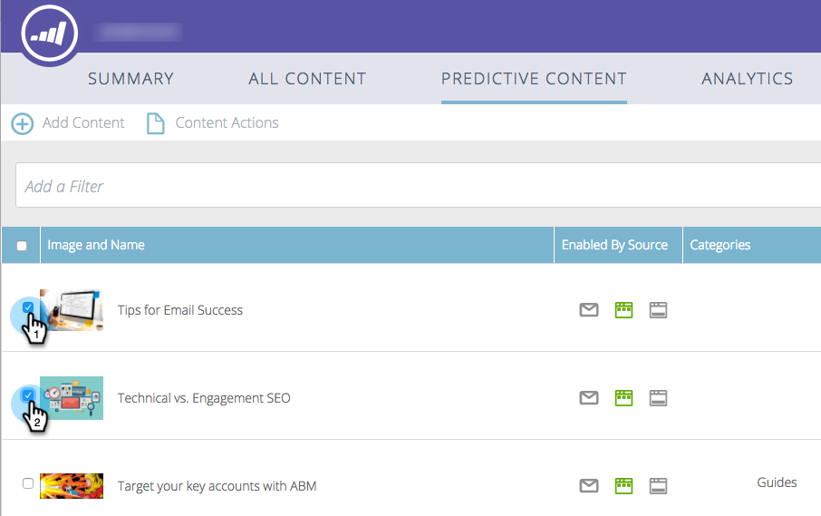
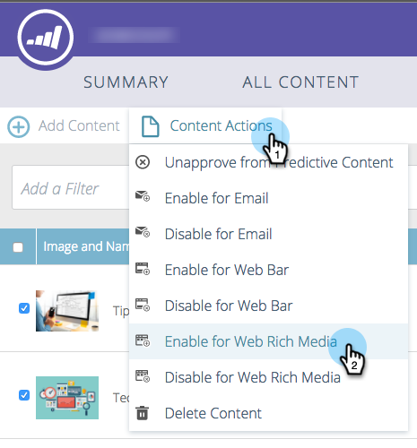
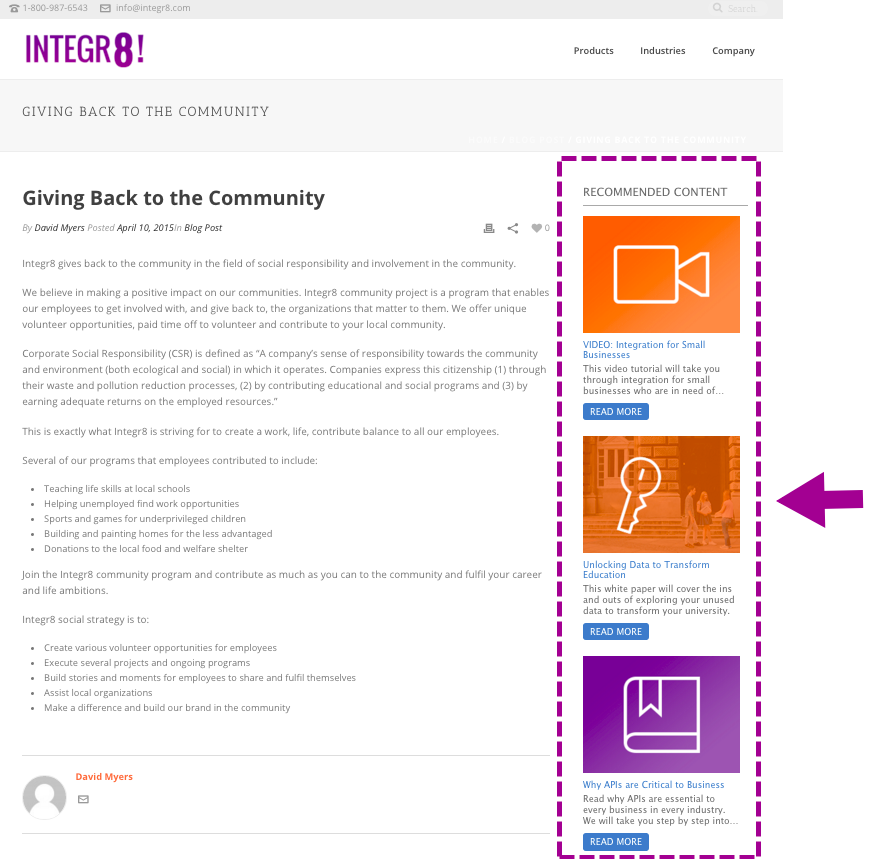

# Abilitare i contenuti predittivi per i rich media per il web {#enable-predictive-content-for-web-rich-media}

I contenuti predittivi coinvolgono i visitatori web con i contenuti più rilevanti, grazie all’apprendimento automatico e alle analisi predittive. Con Web Rich Media, puoi migliorare i contenuti con descrizioni di testo e immagini e incorporare più consigli sui contenuti predittivi nel sito web.

>[!NOTE]
>
>Prima di testare e utilizzare Predictive Content (Contenuto predittivo), si consiglia di abilitare più di cinque contenuti per categoria e per origine (e-mail, rich media, barra). Più contenuti consentono di ottenere risultati predittivi migliori.

>[!PREREQUISITES]
>
>Prima di abilitare il contenuto predittivo, è necessario:
>
>* **Prepara il contenuto predittivo**
>
>   * [Modifica contenuto predittivo per e-mail](/help/marketo/product-docs/predictive-content/working-with-predictive-content/edit-predictive-content-for-emails.md){target="_blank"} o
>   * [Modifica contenuto predittivo per contenuti rich media](/help/marketo/product-docs/predictive-content/working-with-predictive-content/edit-predictive-content-for-rich-media.md){target="_blank"} o
>   * [Modifica contenuto predittivo per la barra dei consigli](/help/marketo/product-docs/predictive-content/working-with-predictive-content/edit-predictive-content-for-the-recommendation-bar.md){target="_blank"}
>
>* [Approva un titolo per il contenuto predittivo](/help/marketo/product-docs/predictive-content/working-with-all-content/approve-a-title-for-predictive-content.md){target="_blank"}

Dopo aver preparato il titolo, la descrizione e l’immagine del contenuto per Rich Media, puoi abilitare singole parti o più parti di contenuto.

1. Per abilitare un singolo titolo, fai clic su un titolo per aprire l’editor. Fare clic su **[!UICONTROL Rich Media]**, quindi selezionare la casella **[!UICONTROL Enabled for Predictive Content in Rich Media]** e fare clic su **[!UICONTROL Save]**.

   

1. Per più parti di contenuto, nella pagina **[!UICONTROL Predictive Content]**, seleziona le caselle accanto ai titoli.

   

1. Fai clic sul menu a discesa **[!UICONTROL Content Actions]** e seleziona **[!UICONTROL Enable for Web Rich Media]**.

   |

## Personalizza il codice JavaScript e incorporalo nel tuo sito web  {#customize-the-javascript-code-and-embed-it-into-your-website}

Consulta la documentazione relativa al modello di consigli per contenuti multimediali avanzati [sul sito per sviluppatori di Marketo](https://experienceleague.adobe.com/en/docs/marketo-developer/marketo/javascriptapi/rich-media-recommendation){target="_blank"}. Questo spiega come personalizzare il modello per il sito web.

Incolla il codice JavaScript nel tuo sito web nel percorso in cui desideri visualizzare il modello.

**Esempi di modelli**

* Template1: Tre parti di contenuto orizzontale con immagini, intestazione e descrizione
* Template2: Tre parti di contenuto verticale con immagini, intestazione e descrizione

Di seguito è riportato un esempio di Modello 1 per consigli per contenuti multimediali avanzati:

Di seguito è riportato un esempio di Modello2 consigli per contenuti multimediali avanzati:

