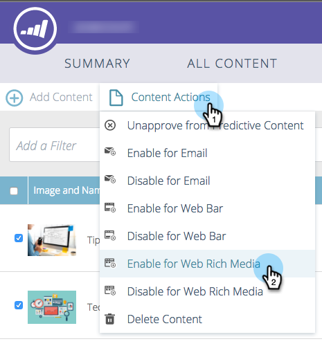

# Abilita contenuti predittivi per contenuti multimediali web {#enable-predictive-content-for-web-rich-media}

I contenuti predittivi coinvolgono i visitatori web con i contenuti più rilevanti, basati sull’apprendimento automatico e sull’analisi predittiva. Con i contenuti multimediali avanzati per web, è possibile migliorare i contenuti con descrizioni e immagini di testo e incorporare più consigli relativi ai contenuti predittivi sul sito web.

>[!NOTE]
>
>Si consiglia di abilitare più di cinque contenuti per categoria e per fonte (e-mail, rich media, barra) prima di testare e utilizzare il contenuto predittivo. Più contenuto ti dà un risultato predittivo migliore.

>[!PREREQUISITES]
>
>Prima di abilitare il contenuto predittivo, devi:
>
>* **Preparare il contenuto predittivo**
   >
   >   * [Modifica del contenuto predittivo per le e-mail](/help/marketo/product-docs/predictive-content/working-with-predictive-content/edit-predictive-content-for-emails.md){target=&quot;_blank&quot;} o
   >   * [Modifica di contenuti predittivi per contenuti rich media](/help/marketo/product-docs/predictive-content/working-with-predictive-content/edit-predictive-content-for-rich-media.md){target=&quot;_blank&quot;} o
   >   * [Modifica contenuto predittivo per la barra delle raccomandazioni](/help/marketo/product-docs/predictive-content/working-with-predictive-content/edit-predictive-content-for-the-recommendation-bar.md){target=&quot;_blank&quot;}
>
>* [Approvare un titolo per il contenuto predittivo](/help/marketo/product-docs/predictive-content/working-with-all-content/approve-a-title-for-predictive-content.md){target=&quot;_blank&quot;}

Dopo aver preparato il titolo del contenuto, la descrizione e l’immagine per i contenuti multimediali avanzati, puoi abilitare elementi di contenuto singoli o multipli.

1. Per abilitare un singolo titolo, fai clic su un titolo per aprire l’editor. Fai clic su Rich Media, quindi seleziona la **Abilitato per contenuti predittivi in contenuti rich media** e fai clic su **Salva**.

   

1. Per più parti di contenuto, nella sezione **Contenuto predittivo** selezionare le caselle accanto ai titoli.

   

1. Fai clic sul pulsante **Azioni contenuto** a discesa e seleziona **Abilita per contenuti multimediali avanzati web**.

   |

## Personalizza il codice JavaScript e incorporalo nel tuo sito web  {#customize-the-javascript-code-and-embed-it-into-your-website}

Consulta la documentazione per il modello di raccomandazione Rich Media [sul sito Marketo Developers](https://developers.marketo.com/documentation/websites/rtp-rich-media-recommendations-api){target=&quot;_blank&quot;}. Questo spiega come personalizzare il modello per il sito web.

Incolla il codice JavaScript nel sito web nel percorso in cui desideri visualizzare il modello.

**Esempi di modelli**

* Modello 1: Tre parti di contenuto orizzontale con immagini, intestazione e descrizione
* Modello 2: Tre parti di contenuto verticale con immagini, intestazione e descrizione

Ecco un esempio del modello di raccomandazione Rich Media1:

Ecco un esempio del modello di raccomandazione Rich Media2:

