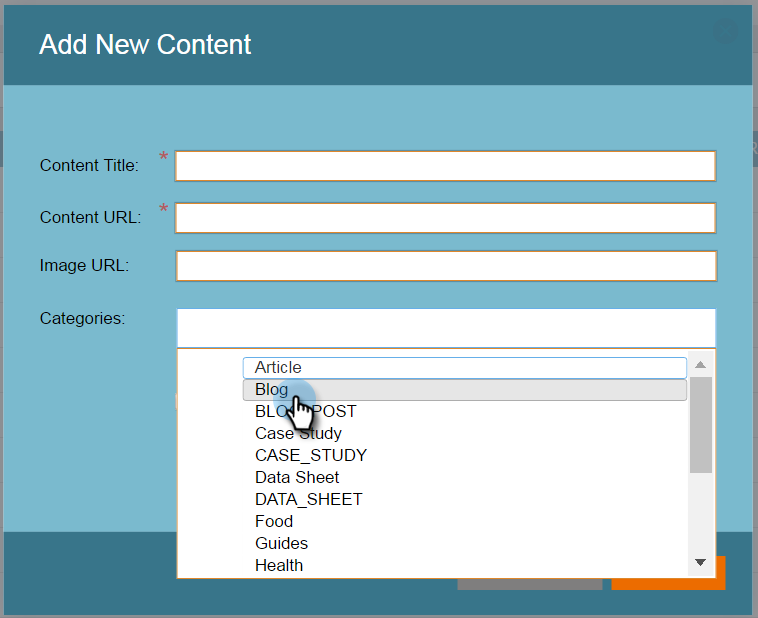
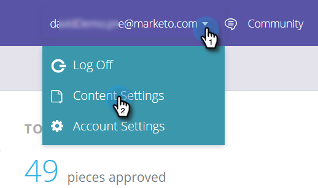
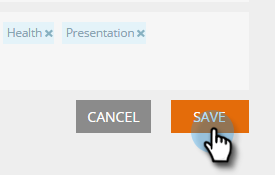

# Configurare categorie {#set-up-categories}

Crea categorie in Contenuto predittivo per raggruppare i risultati predittivi sul web o e-mail. Ad esempio, puoi lavorare solo con i blog o con contenuti in una particolare lingua. Consente inoltre di cercare e filtrare la visualizzazione della pagina.  Le categorie vengono visualizzate nelle pagine [!UICONTROL All Content] e [!UICONTROL Predictive Content] per riferimento semplice.

Quando modifichi il contenuto individuato, aggiungi delle categorie nella schermata di modifica. Fai clic sul campo **[!UICONTROL Categories]** e selezionali dal menu a discesa.

Quando aggiungi contenuto, puoi assegnare a esso i tag con le categorie selezionate nel pop-up.

## Crea tag categoria {#create-category-tags}

Ecco come creare i tag delle categorie.

1. Passa a **[!UICONTROL Content Settings]**.

   

1. Fai clic su **[!UICONTROL Categories]**.

   

1. Vengono visualizzati i tag di categoria esistenti. Immettere un nuovo tag categoria e fare clic su **[!UICONTROL Create New]**.

   

1. Per rimuovere un tag di categoria, fai clic su **x** accanto a esso.

   

1. Al termine, fare clic su **[!UICONTROL Save]**.

   

   Molto semplice.
