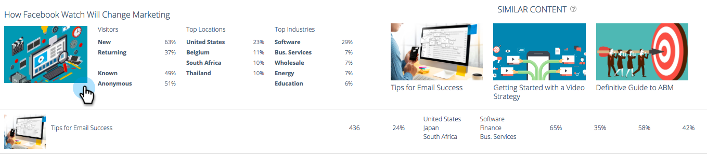

# Panoramica di Predictive Content Analytics {#predictive-content-analytics-overview}

Utilizza l’analisi dei contenuti per ottenere ulteriori informazioni sui contenuti esistenti, per scoprire (in base all’intelligenza artificiale e agli algoritmi predittivi) quali contenuti funzionano per i tuoi tipi di pubblico e per incrementare il ROI delle tue attività di marketing.

>[!NOTE]
>
>La scheda Analytics e le funzioni di analisi dei contenuti sono disponibili esclusivamente con Marketo Predictive Content.

## Panoramica {#overview}

Nella pagina Riepilogo, fai clic su **Analytics**.

Analytics si compone di diverse sezioni: Contenuto principale per visualizzazioni, Contenuto principale per tasso di conversione, Contenuto di tendenza, Contenuto suggerito e Contenuto.

Passa il puntatore del mouse sul punto interrogativo in un&#39;intestazione di sezione per ulteriori dettagli.

Fai clic sul pulsante di esportazione per esportare i risultati di quella sezione tramite Excel.

È possibile filtrare i risultati per vari attributi/proprietà (ad esempio ABM Account List, Country, ecc.).

Fai clic sull’icona del calendario per modificare le date dei dati visualizzati. Scegli una quantità di tempo preimpostata o un intervallo di date specifico.

## Contenuto principale per visualizzazioni {#top-content-by-views}

Visualizza le parti di contenuto principali in base al numero di visualizzazioni per l’intervallo di date selezionato.

## Contenuto principale per tasso di conversione {#top-content-by-conversion-rate}

Visualizza il contenuto di conversione superiore in base al tasso di conversione per l’intervallo di date selezionato.

>[!NOTE]
>
>**Definizione**
>
>**Tasso di conversione**: Una percentuale calcolata per conversioni dirette divise per clic.

## Contenuto di tendenza {#trending-content}

Mostra l’aumento di popolarità di un elemento di contenuto osservando l’ultimo aumento di due settimane nelle visualizzazioni rispetto allo stesso periodo precedente.

## Contenuto consigliato {#suggested-content}

Visualizza il contenuto che ti consigliamo di promuovere nelle attività di marketing in base al filtro definito.

Passa il puntatore del mouse su un&#39;immagine in Contenuti consigliati per visualizzare le opzioni disponibili.

>[!NOTE]
>
>Vedete quelle icone in basso? Da sinistra a destra sono: Visualizza contenuto, Esporta in CSV, Approva contenuto.

## Contenuto {#content}

Cerca il contenuto desiderato e fai clic su di esso per visualizzare ulteriori dettagli, tra cui: i visitatori che lo visualizzano, nuovi rispetto al ritorno, noti e anonimi, le posizioni principali da cui provengono i visitatori durante la visualizzazione del contenuto e le principali industrie dedotte da cui provengono.

>[!NOTE]
>
>Contenuto simile si basa sul contenuto selezionato e viene calcolato da un algoritmo delle regole di associazione. I risultati rappresentano parti di contenuto su cui i visitatori probabilmente faranno clic, a seconda del pezzo selezionato e del comportamento del visitatore precedente. Non tiene conto del filtro o dell’intervallo di date.
