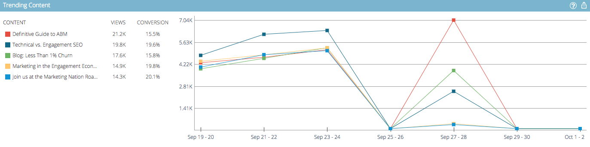

# Panoramica di Predictive Content Analytics {#predictive-content-analytics-overview}

Utilizza l’analisi dei contenuti per acquisire ulteriori informazioni sui contenuti esistenti, scoprire (in base all’intelligenza artificiale e agli algoritmi predittivi) quali contenuti funzionano per il pubblico e aumentare il ROI derivante dalle attività di marketing.

>[!NOTE]
>
>La scheda Analytics e le funzioni di analisi dei contenuti sono disponibili esclusivamente con Marketo Predictive Content.

## Panoramica {#overview}

Nella pagina Riepilogo fare clic su **Analytics**.

Analytics comprende diverse sezioni: Contenuto principale per visualizzazioni, Contenuto principale per tasso di conversione, Contenuto di tendenza, Contenuto suggerito e Contenuto.

Passa il cursore del mouse sul punto interrogativo in un’intestazione di sezione per visualizzare ulteriori dettagli.

Fai clic sul pulsante Esporta per esportare i risultati di quella sezione tramite Excel.

Puoi filtrare i risultati per vari attributi/proprietà (ad esempio, Elenco account ABM, Paese, ecc.).

Fai clic sull’icona del calendario per modificare le date dei dati riflessi. Scegli un periodo di tempo predefinito o un intervallo di date specifico.

## Contenuto principale per visualizzazioni {#top-content-by-views}

Visualizza i contenuti principali in base al numero di visualizzazioni per intervallo di date selezionato.

## Contenuto principale per tasso di conversione {#top-content-by-conversion-rate}

Visualizza il contenuto di conversione superiore in base al tasso di conversione per l’intervallo di date selezionato.

>[!NOTE]
>
>**Definizione**
>
>**Tasso di conversione**: percentuale calcolata dividendo le conversioni dirette per i clic.

## Contenuto di tendenza {#trending-content}

Mostra l’aumento di popolarità di un contenuto osservando l’aumento di visualizzazioni delle ultime due settimane rispetto allo stesso periodo precedente.

## Contenuto consigliato {#suggested-content}

Visualizza il contenuto che ti consigliamo di promuovere nelle attività di marketing in base al filtro definito.

Passa il puntatore del mouse su un’immagine in Contenuto consigliato per visualizzare le opzioni disponibili.

>[!NOTE]
>
>Vedi quelle icone in basso? Da sinistra a destra sono: Visualizza contenuto, Esporta in CSV, Approva contenuto.

## Contenuto {#content}

Cerca il contenuto desiderato e fai clic su di esso per visualizzare ulteriori dettagli, tra cui: i visitatori che lo visualizzano, quelli nuovi rispetto a quelli di ritorno, noti e anonimi, le posizioni principali da cui provengono i visitatori quando visualizzano il contenuto e i principali settori dedotti da cui provengono.

>[!NOTE]
>
>Un contenuto simile si basa sulla parte di contenuto selezionata e viene calcolato da un algoritmo delle regole di associazione. I risultati rappresentano parti di contenuto su cui i visitatori faranno probabilmente clic, a seconda della parte selezionata e del comportamento del visitatore passato. Non tiene conto del filtro o dell’intervallo di date.
