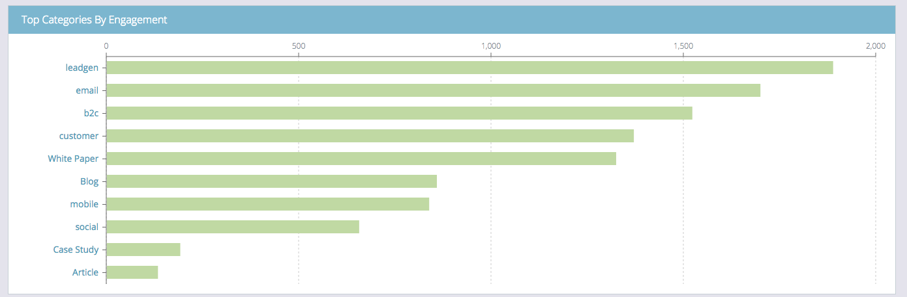

# Riepilogo del contenuto predittivo {#the-predictive-content-summary}

Il Riepilogo del contenuto predittivo visualizza le informazioni necessarie sul contenuto predittivo con tabelle, grafici e numeri correnti.

## Barra superiore {#top-bar}

La barra superiore mostra i numeri correnti per il contenuto e le visualizzazioni e il numero di parti abilitate. Seleziona una visualizzazione degli ultimi 7 o 30 giorni per l’intera pagina, in alto a destra.

## Tabella prestazioni {#performance-table}

Qui puoi vedere i tuoi 10 contenuti principali scoperti, tra cui visualizzazioni, lead diretti e tasso di conversione.

## [!UICONTROL Predictive Engagement] {#predictive-engagement}

Visualizza il tasso di conversione confrontando i clic totali e i lead diretti e confronta le prestazioni delle diverse origini.

## [!UICONTROL Content Trend by Views]  {#content-trend-by-views}

Confronta la corrispondenza tra le visualizzazioni di tutti i contenuti e i contenuti predittivi.

## [!UICONTROL Top Categories by Engagement] {#top-categories-by-engagement}

Quali categorie di contenuti sono più interessanti? Visualizzatelo in questo grafico.

>[!NOTE]
>
>Se fai clic su un collegamento di categoria (esempi nell’immagine precedente: lead, e-mail, ecc.), viene aperta la pagina Tutto il contenuto con la categoria su cui hai fatto clic aggiunta al filtro, in cui viene visualizzata l’analisi del contenuto in quella categoria.
