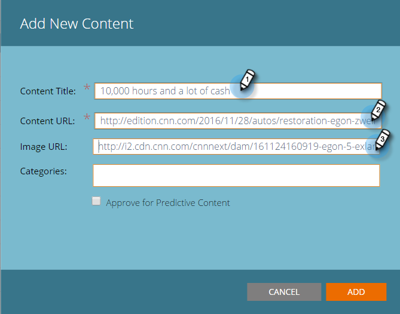
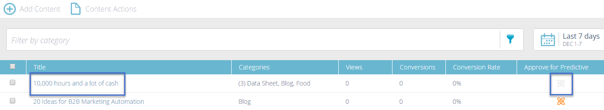

# Aggiungere contenuti nuovi {#add-new-content}

È possibile aggiungere facilmente il contenuto manualmente alla pagina [!UICONTROL All Content].

1. Fai clic sul menu a discesa **[!UICONTROL Add Content]** e seleziona **[!UICONTROL Add Content]**.

   

1. Inserisci un titolo e un URL e, se necessario, un URL immagine.

   

1. Per aggiungere categorie, fai clic sul campo e seleziona dal menu a discesa.

   

1. Fai clic su **[!UICONTROL Add]**.

   

1. Il nuovo titolo verrà visualizzato nella pagina **[!UICONTROL All Content]**. Nota che non è ancora approvato per il contenuto predittivo.

   

1. Ecco come aggiungerlo a [Predictive Content](/help/marketo/product-docs/predictive-content/working-with-all-content/approve-a-title-for-predictive-content.md).
