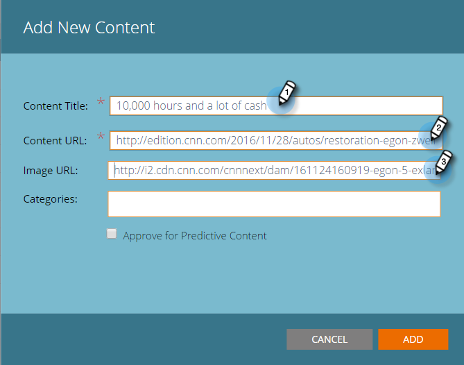

# Aggiungi nuovo contenuto {#add-new-content}

Puoi aggiungere facilmente il contenuto manualmente alla pagina Tutti i contenuti.

1. Fai clic su **Aggiungi contenuto** a discesa e selezionare **Aggiungi contenuto**.

   

1. Inserisci un titolo e un URL e, se necessario, un URL immagine.

   

1. Per aggiungere categorie, fai clic sul campo e seleziona dal menu a discesa.

   

1. Clic **Aggiungi**.

   

1. Il nuovo titolo viene ora visualizzato sulla **Tutti i contenuti** pagina. Nota che non è ancora approvato per il contenuto predittivo.

   

1. Ecco come aggiungerlo a [Contenuto predittivo](/help/marketo/product-docs/predictive-content/working-with-all-content/approve-a-title-for-predictive-content.md).
