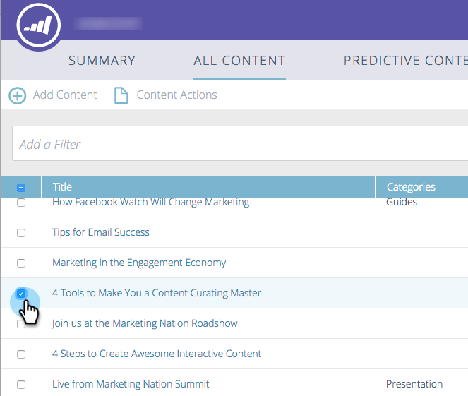
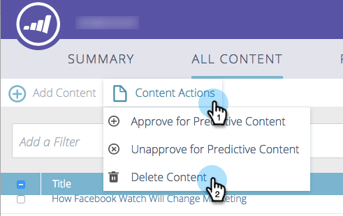

# Eliminare contenuto {#delete-content}

Quando non hai più bisogno di contenuti, puoi eliminarli facilmente.

1. Seleziona la casella accanto alla parte di contenuto che desideri rimuovere.

   

1. Fai clic sul menu a discesa **[!UICONTROL Content Actions]** e seleziona **[!UICONTROL Delete Content]**.

   
