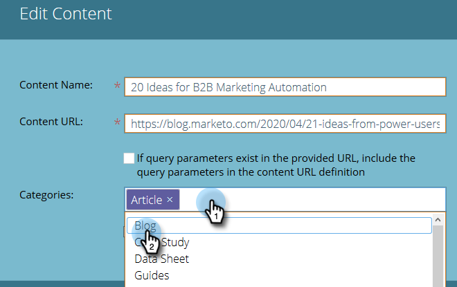

# Modificare contenuto {#edit-content}

È possibile apportare alcune modifiche alle inserzioni nella pagina [!UICONTROL All Content].

1. Nella pagina **[!UICONTROL All Content]**, posizionare il puntatore del mouse sulla riga del titolo che si desidera modificare e fare clic sull&#39;icona di modifica.

   

1. Apportare modifiche a [!UICONTROL Content Name] e [!UICONTROL Content URL] (la casella di controllo dei parametri di query è facoltativa).

   

1. Fare clic sul campo **[!UICONTROL Categories]** per aggiungere/rimuovere categorie. Seleziona nuove dal menu a discesa. È possibile rimuovere una categoria attualmente selezionata facendo clic sulla relativa **X**.

   

1. Selezionare la casella **[!UICONTROL Approve for Predictive Content]** per approvare o deselezionare la casella per annullare l&#39;approvazione. Al termine, fai clic su **[!UICONTROL Save]**.

   
