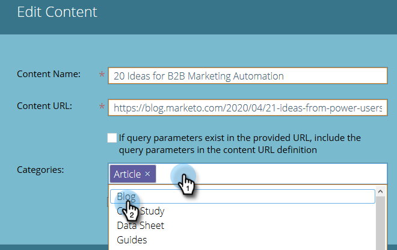

# Modifica contenuto {#edit-content}

È possibile apportare alcune modifiche agli elenchi nella pagina Tutti i contenuti.

1. Sulla **Tutto il contenuto** , passa il puntatore del mouse sulla riga del titolo da modificare e fai clic sull’icona di modifica .

   

1. Apporta modifiche al Titolo contenuto e all’URL contenuto (la casella di controllo Parametri query è facoltativa).

   

1. Fai clic sul pulsante **Categorie** campo per aggiungere/rimuovere categorie. Selezionane nuove dal menu a discesa. Per rimuovere una categoria attualmente selezionata, fai clic sui relativi **X**.

   

1. Controlla la **Approva per il contenuto predittivo** per approvare o deselezionare la casella per annullare l&#39;approvazione. Fai clic su **Salva** al termine.

   
