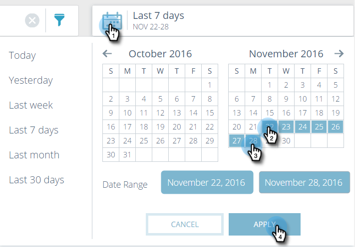

# Informazioni su tutto il contenuto {#understanding-all-content}

>[!NOTE]
>
>A seconda della data di acquisto, l’iscrizione a Marketo può includere contenuti predittivi di marketing o contenuti`AI`. Per gli utenti che utilizzano contenuti predittivi, Marketo attiva le funzioni di analisi dei contenuti`AI` fino al 30 aprile 2018. Per mantenere queste funzionalità oltre tale data, contatta il tuo Customer Success Manager di Marketo per effettuare l&#39;aggiornamento al contenuto`AI`di Marketo.

La pagina Tutto il contenuto visualizza tutto il contenuto che è stato scoperto o aggiunto manualmente.   

I campi della pagina includono:

* **Titolo**: Nome del contenuto
* **Categorie**: Creato da voi e utilizzato per raggruppare i risultati predittivi per il Web o l&#39;e-mail
* **Viste**: Totale clic sul contenuto Web scoperto (comprese tutte le origini)
* **Conversioni**: Numero di visitatori che hanno visualizzato un contenuto e completato un modulo nella stessa visita
* **Tasso** di conversione: Una percentuale calcolata per conversioni dirette divise per clic
* **Approva per predictive**: L&#39;icona viene visualizzata se il contenuto è approvato

Potete aggiungere una nuova parte di contenuto e tenerne traccia, rimuovere una parte di contenuto o approvare una parte di contenuto. Dopo aver approvato il contenuto, potete modificarlo nella pagina Predictive Content (Contenuto predittivo).

## Filtra contenuto per categorie  {#filter-content-by-categories}

Filtrare il contenuto selezionando una o più categorie. Quindi, configurate l&#39;intervallo di date o date per l&#39;analisi dei contenuti, utilizzando le impostazioni standard o personalizzate.

1. Nella pagina **Tutto il contenuto** , fate clic sull&#39;icona del filtro e, in **Categoria**, selezionate una o più categorie di contenuto.

   

1. Ora, viene visualizzato solo il contenuto di quella categoria.

   

## Visualizza analisi per un intervallo di date o date {#display-analytics-for-a-date-or-date-range}

1. Per visualizzare i dati per una data o un intervallo di date specifico, fai clic sull&#39;icona del calendario, quindi seleziona il calendario dal pannello a sinistra. Per un intervallo di date personalizzato, fai clic sul primo e sull&#39;ultimo giorno dell&#39;intervallo di date nel calendario (come mostrato). Fate clic su **Applica**.

   

1. A questo punto, l&#39;analisi mostra il contenuto nell&#39;intervallo di date selezionato.

>[!NOTE]
>
>**Articoli correlati**
>
>* [Aggiungi nuovo contenuto](add-new-content.md)
>* [Elimina contenuto](delete-content.md)
>* [Approvare un titolo per il contenuto predittivo](approve-a-title-for-predictive-content.md)
>* [Disapprovare un titolo per il contenuto predittivo](unapprove-a-title-for-predictive-content.md)

>

