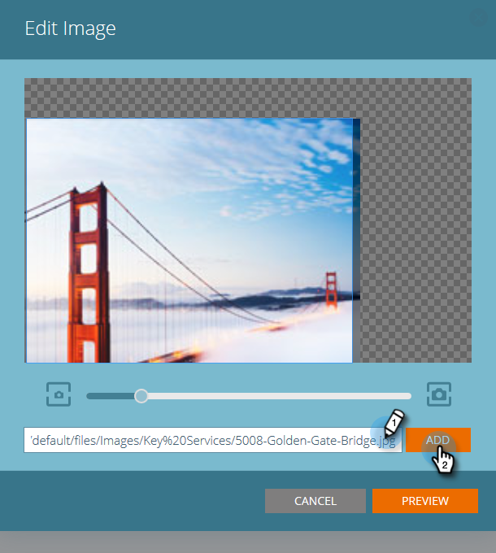
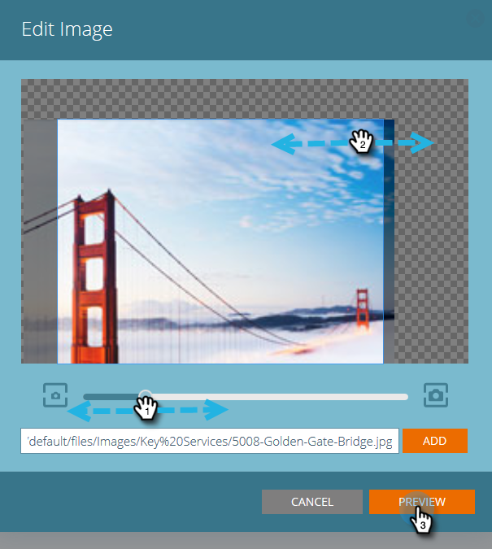
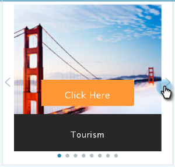
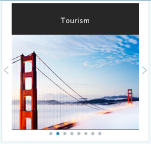

# Modifica contenuto predittivo per e-mail {#edit-predictive-content-for-emails}

Ecco come impostare il contenuto predittivo per le e-mail.

>[!PREREQUISITES]
>
>Il contenuto deve essere [approvato per il contenuto predittivo](/help/marketo/product-docs/predictive-content/working-with-all-content/approve-a-title-for-predictive-content.md) nella pagina Tutti i contenuti.

1. Nella pagina Predictive Content (Contenuto predittivo), fai clic su un titolo per aprire l’editor.

   

1. Viene visualizzata la pagina di modifica. **** Per impostazione predefinita viene visualizzata l’e-mail.

   

   >[!NOTE]
   >
   >Titolo e URL già popolati. Verifica che siano quello che vuoi.

1. Per aggiungere/modificare l’etichetta del pulsante, digitare nella casella di testo a destra.

   

   >[!NOTE]
   >
   >Se hai modificato l’etichetta del pulsante, questa viene aggiornata quando salvi le modifiche o visualizzi l’anteprima dell’immagine.

1. Per aggiungere o modificare l&#39;URL dell&#39;immagine, fai clic su **Modifica immagine**.

   

   >[!CAUTION]
   >
   >Per garantire la migliore qualità, l&#39;immagine deve essere di 400x400 pixel o più piccola.

1. Inserisci l&#39;URL dell&#39;immagine e fai clic su **Aggiungi**.

   

1. Fai clic e trascina il cursore per modificare le dimensioni dell’immagine. Quindi fai clic e trascina la casella di ritaglio per isolare l’area dell’immagine desiderata che desideri utilizzare. Al termine, fai clic su **Anteprima**.

   

1. Fai clic sulle frecce sui lati per scorrere e visualizzare il contenuto in ciascuna delle anteprime del layout dell’e-mail (sono visualizzate due opzioni).

   |  |  |
   |---|---|

1. Facoltativamente, fai clic sul campo **Categorie** e aggiungi categorie al contenuto. Le opzioni provengono dalle [categorie già impostate](/help/marketo/product-docs/predictive-content/getting-started/set-up-categories.md).

   

1. Seleziona la casella per abilitare Predictive Content in Email.

   

1. Fare clic su **Salva**.

   

   >[!NOTE]
   >
   >In Marketo Email Editor v2.0, è inoltre possibile [visualizzare i modelli di layout](/help/marketo/product-docs/predictive-content/enabling-predictive-content/enable-predictive-content-in-emails.md) utilizzati durante l&#39;abilitazione del contenuto.
