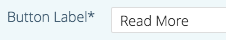

# Modificare i contenuti predittivi per le e-mail {#edit-predictive-content-for-emails}

Ecco come impostare il contenuto predittivo per le e-mail.

>[!PREREQUISITES]
>
>Il contenuto deve essere [approvato per il contenuto predittivo](/help/marketo/product-docs/predictive-content/working-with-all-content/approve-a-title-for-predictive-content.md) nella pagina [!UICONTROL All Content].

1. Nella pagina [!UICONTROL Predictive Content], fare clic su un titolo per aprire l&#39;editor.

   

1. Viene visualizzata la pagina di modifica. **[!UICONTROL Email]** viene visualizzato per impostazione predefinita.

   

   >[!NOTE]
   >
   >Il titolo e l’URL sono già compilati. Verifica che siano quello che desideri.

1. Per aggiungere o modificare l&#39;etichetta del pulsante, digitare nella casella di testo a destra.

   

   >[!NOTE]
   >
   >Se hai modificato l’etichetta del pulsante, questa verrà aggiornata quando salvi le modifiche o visualizzi l’anteprima dell’immagine.

1. Per aggiungere o modificare l&#39;URL immagine, fare clic su **[!UICONTROL Edit Image]**.

   

   >[!CAUTION]
   >
   >Per garantire la migliore qualità, l&#39;immagine deve essere di 400x400 pixel o inferiore.

1. Inserire l&#39;URL dell&#39;immagine e fare clic su **[!UICONTROL Add]**.

   

1. Fai clic e trascina il cursore per modificare le dimensioni dell’immagine. Quindi fate clic e trascinate la casella di ritaglio per isolare l&#39;area immagine desiderata. Al termine, fai clic su **[!UICONTROL Preview]**.

   

1. Fai clic sulle frecce ai lati per scorrere e visualizzare il contenuto in ciascuna anteprima del layout dell’e-mail (vengono visualizzate due opzioni).

   |  |  |
   |---|---|

1. Facoltativamente, fare clic sul campo **[!UICONTROL Categories]** e aggiungere categorie al contenuto. Le opzioni provengono dalle [categorie già impostate](/help/marketo/product-docs/predictive-content/getting-started/set-up-categories.md).

   

1. Seleziona la casella per abilitare Predictive Content in Email (Contenuto predittivo in e-mail).

   

1. Fai clic su **[!UICONTROL Save]**.

   

   >[!NOTE]
   >
   >In Marketo Email Editor v2.0, puoi anche [visualizzare i modelli di layout](/help/marketo/product-docs/predictive-content/enabling-predictive-content/enable-predictive-content-in-emails.md) che utilizzi mentre abiliti il contenuto.
