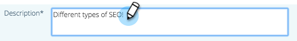

# Modifica contenuto predittivo per contenuti rich media {#edit-predictive-content-for-rich-media}

Ecco come impostare i contenuti predittivi per Rich Media.

>[!PREREQUISITES]
>
>Il contenuto deve essere [approvato per contenuti predittivi](/help/marketo/product-docs/predictive-content/working-with-all-content/approve-a-title-for-predictive-content.md) nella pagina Tutti i contenuti.

1. Il giorno **Contenuto predittivo** , fai clic su un titolo per aprire l’editor.

   

1. Clic **Contenuti multimediali avanzati**.

   

1. Noterai che è possibile avere immagini separate per e-mail e contenuti multimediali avanzati. Per aggiungere o modificare l’immagine, incolla l’URL dell’immagine nella relativa casella di testo.

   

1. Digita in un **Descrizione**.

   

1. Fai clic su **Categorie** casella per selezionare/aggiungere [categorie già configurate](/help/marketo/product-docs/predictive-content/getting-started/set-up-categories.md) (facoltativo).

   

   >[!NOTE]
   >
   >Utilizza le categorie per raggruppare il contenuto per un modello di consigli per contenuti rich media specifico. Lascia vuota la categoria per applicare il contenuto a tutti i modelli di consigli (scelta consigliata).
   >
   >Tuttavia, se desideri consigliare solo contenuti specifici per un modello Rich Media, aggiungi una categoria per il contenuto e associa tale categoria al modello di consigli.
   >
   >Ad esempio, categorizza i contenuti pertinenti in base alle sezioni del sito web (prodotti o soluzioni).

1. Seleziona la casella per abilitare Predictive Content in Rich Media.

   

1. Clic **Salva**.

   
