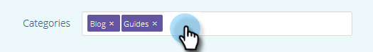

# Modifica di contenuti predittivi per contenuti rich media {#edit-predictive-content-for-rich-media}

Ecco come impostare i contenuti predittivi per i contenuti rich media.

>[!PREREQUISITES]
>
>Il contenuto deve essere [approvato per il contenuto predittivo](/help/marketo/product-docs/predictive-content/working-with-all-content/approve-a-title-for-predictive-content.md) nella pagina Tutti i contenuti.

1. Sulla **Contenuto predittivo** , fai clic su un titolo per aprire l’editor.

   

1. Fai clic su **Contenuti multimediali**.

   

1. Noterai che puoi avere immagini separate per E-mail e contenuti rich media. Per aggiungere/modificare l’immagine, incolla l’URL dell’immagine nella relativa casella di testo.

   

1. Digita in un **Descrizione**.

   

1. Fai clic sul pulsante **Categorie** casella per selezionare/aggiungere [categorie già impostate](/help/marketo/product-docs/predictive-content/getting-started/set-up-categories.md) (facoltativo).

   

   >[!NOTE]
   >
   >Utilizza le categorie per raggruppare i contenuti per un modello di raccomandazione Rich Media specifico. Lasciate vuota la categoria per applicare il contenuto a tutti i modelli di raccomandazione (consigliato).
   >
   >Tuttavia, se desideri consigliare solo contenuti specifici per un modello Rich Media, aggiungi una categoria per il contenuto e associa tale categoria al modello di raccomandazione.
   >
   >Ad esempio, categorizza i contenuti pertinenti in base alle sezioni del sito web (prodotti o soluzioni).

1. Seleziona la casella per abilitare Predictive Content in Rich Media.

   

1. Fai clic su **Salva**.

   
