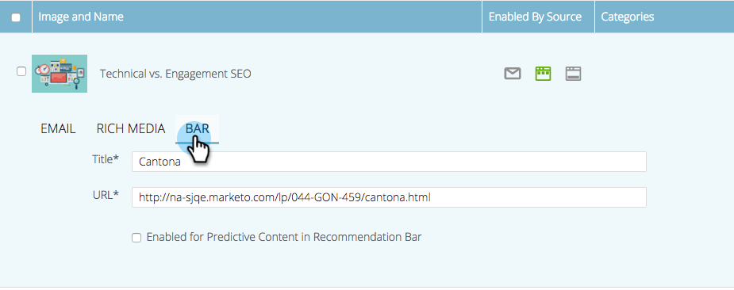

# Modificare i contenuti predittivi per la barra dei consigli {#edit-predictive-content-for-the-recommendation-bar}

Per impostare il contenuto predittivo per la barra dei consigli, procedere come segue.

>[!PREREQUISITES]
>
>Il contenuto deve essere [approvato per il contenuto predittivo](/help/marketo/product-docs/predictive-content/working-with-all-content/approve-a-title-for-predictive-content.md) nella pagina Tutti i contenuti.

1. Nella pagina **[!UICONTROL Predictive Content]**, fare clic su un titolo per aprire l&#39;editor.

   

1. Fai clic su **[!UICONTROL Bar]**.

   

1. Seleziona la casella per abilitare Predictive Content (Contenuto predittivo) nella barra dei consigli.

   

1. Fai clic su **[!UICONTROL Save]**.

   
