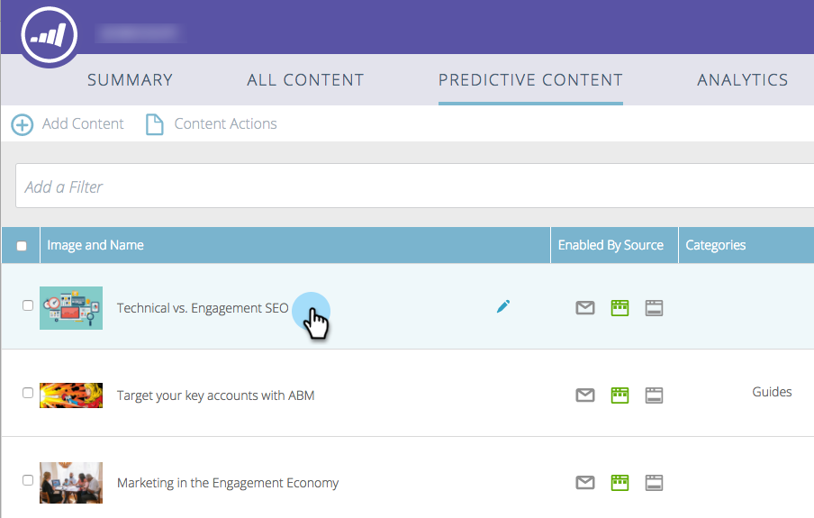

# Modifica contenuto predittivo per la barra delle raccomandazioni {#edit-predictive-content-for-the-recommendation-bar}

Ecco come impostare il contenuto predittivo per la barra delle raccomandazioni.

>[!PREREQUISITES]
>
>Il contenuto deve essere [approvato per il contenuto predittivo](/help/marketo/product-docs/predictive-content/working-with-all-content/approve-a-title-for-predictive-content.md) nella pagina Tutti i contenuti.

1. Sulla **Contenuto predittivo** , fai clic su un titolo per aprire l’editor.

   

1. Fai clic su **Barre**.

   

1. Seleziona la casella per abilitare Predictive Content (Contenuto predittivo) nella barra delle raccomandazioni.

   

1. Fai clic su **Salva**.

   
