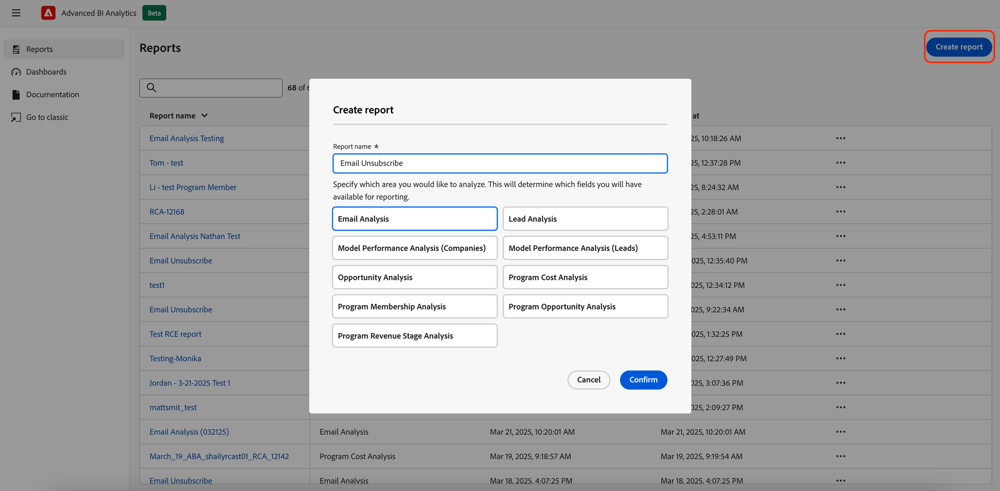
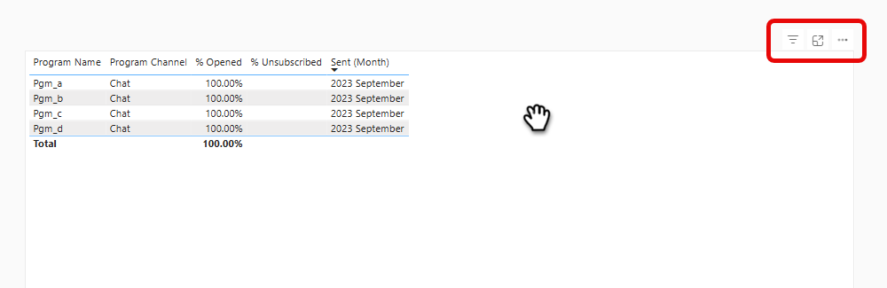

# Panoramica di Advanced BI Analytics {#advanced-bi-analytics-overview}

Advanced BI Analytics (precedentemente noto come Revenue Explorer e Advanced Report Builder) offre un’interfaccia flessibile di reporting e visualizzazione sui dati Marketo Engage, fornendo dettagli granulari su progressione, prestazioni e altro ancora. Offre maggiore interattività e visualizzazione, prestazioni più veloci e un&#39;esperienza utente più fluida e intuitiva.

Questi miglioramenti consentono di risparmiare tempo, scoprire informazioni più importanti, favorire l’ottimizzazione e condividere storie di dati più coinvolgenti con colleghi e stakeholder.

>[!PREREQUISITES]
>
>Per accedere a questa funzione, è necessario aver acquistato il componente aggiuntivo Advanced BI Analytics. Per ulteriori informazioni, contatta il team dell’account di Adobe (il tuo Account Manager).

## Caratteristiche principali e vantaggi {#key-features-and-benefits}

* **Motore di query ad alte prestazioni**: fornisce prestazioni cinque volte più veloci su set di dati di grandi dimensioni, consentendo un&#39;elaborazione dei dati più rapida, un caricamento più rapido dei report e un&#39;esperienza di analisi più fluida.

* **Visualizzazione ricca e coinvolgente**: ampia raccolta ampliata di opzioni di visualizzazione incorporate, tra cui grafici, mappe e indicatori KPI, che rendono le dashboard più approfondite, incisive e migliorano in modo significativo la narrazione dei dati.

* **Interattività avanzata e filtro dinamico**: applicazione di filtri dei dati dinamici, filtri incrociati e filtri interdipendenti tra gli elementi visivi. I report a più pagine supportano funzionalità avanzate di drill-down, drill-up e drill-through, garantendo una facile esplorazione dei dati.

* **Interfaccia intuitiva per l&#39;authoring dei report**: un&#39;esperienza point-and-click semplifica la creazione dei report, inclusi i report drill-through a più pagine. L’interfaccia consente agli utenti di progettare rapporti interattivi complessi senza richiedere competenze tecniche approfondite.

* **Condivisione semplice, inclusa l&#39;esportazione di PowerPoint**: la funzionalità di condivisione integrata semplifica la condivisione delle informazioni. Tra le altre destinazioni, gli utenti possono facilmente generare diapositive di PowerPoint pronte per la presentazione.

## Creare un rapporto {#create-a-report}

1. Nel Marketo personale, fare clic sul riquadro **[!UICONTROL Advanced BI Analytics]**.

   {width="800" zoomable="yes"}

1. Nella scheda **[!UICONTROL Reports]**, fare clic su **[!UICONTROL Create Report]**.

   {width="800" zoomable="yes"}

1. Seleziona le misure desiderate.

   {width="800" zoomable="yes"}

1. Selezionate le quote desiderate.

   {width="800" zoomable="yes"}

1. Scegli la visualizzazione desiderata.

   {width="800" zoomable="yes"}

1. Per aggiungere filtri, trascina e rilascia un attributo di dimensione.

   {width="800" zoomable="yes"}

## Esportare un rapporto {#export-a-report}

Quando esportate un report completo, le opzioni di esportazione sono PDF e PPT. Se hai bisogno dei tuoi dati in XLS o CSV, puoi farlo esportando singole visualizzazioni ([vedi di seguito](#export-a-visualization)).

>[!BEGINTABS]

>[!TAB Dalla pagina Rapporti]

1. Nella pagina Report fare clic sull&#39;icona Altro (...) del report desiderato e selezionare **Esporta**.

   

1. Scegli PDF o PPT e fai clic su **Esporta**.

   

>[!TAB All&#39;interno del report]

1. Nel report stesso, fare clic sull&#39;icona Altro (**...**) in alto a destra e selezionare **Esporta**.

   

1. Scegli PDF o PPT e fai clic su **Esporta**.

   

>[!ENDTABS]

### Esportare una visualizzazione {#export-a-visualization}

Scopri come esportare sezioni specifiche del rapporto.

1. Scegli il rapporto desiderato.

   {width="600" zoomable="yes"}

1. Passa il puntatore del mouse sulla visualizzazione per visualizzare tre icone.

   {width="600" zoomable="yes"}

1. Fare clic sull&#39;icona Altro (**...**)

   

1. Seleziona **Esporta dati**.

   

1. Scegli il formato dati desiderato.

   

   >[!NOTE]
   >
   >* _I dati con il layout corrente_ sono disponibili solo per gli elementi visivi di tabelle e matrici.
   * _Dati sottostanti_ non disponibili in Marketo Engage.

1. Scegli il formato di file desiderato (.XLS, .CSV).

   

1. Fai clic su **Esporta**.

## Demo video {#video}

Guarda il video seguente per vedere un esempio di esperienza di report drill-through con più pagine.

>[!VIDEO](https://video.tv.adobe.com/v/3451681/?quality=12&learn=on){transcript=true}

## Rapporti standard in Advanced BI Analytics {#standard-reports}

I seguenti rapporti standard sono inclusi come esempi per i rapporti personalizzati.

<table>
  <thead>
    <tr>
      <th>Area di reporting</th>
      <th>Nome rapporto</th>
    </tr>
  </thead>
  <tbody>
    <tr>
      <td rowspan="8">Analisi e-mail</td>
      <td>E-mail - Attività inviata (in CST)</td>
    </tr>
    <tr>
      <td>E-mail - Attività di clic (in CST)</td>
    </tr>
    <tr>
      <td>E-mail - Attività aperta (in CST)</td>
    </tr>
    <tr>
      <td>E-mail - Distribuzione del tempo di clic (in CST)</td>
    </tr>
    <tr>
      <td>E-mail - Decadimento tasso di apertura</td>
    </tr>
    <tr>
      <td>E-mail - Distribuzione del tempo di apertura (in CST)</td>
    </tr>
    <tr>
      <td>E-mail - Dettagli sulle prestazioni</td>
    </tr>
    <tr>
      <td>E-mail - Decadimento percentuale clic</td>
    </tr>
    <tr>
      <td rowspan="8">Analisi dei lead</td>
      <td>Primi 10 origini lead per lead convertiti</td>
    </tr>
    <tr>
      <td>10 origini lead principali</td>
    </tr>
    <tr>
      <td>Rapporto sulle infrazioni SLA</td>
    </tr>
    <tr>
      <td>Rapporto Scadenzario lead</td>
    </tr>
    <tr>
      <td>Rapporto Saldo lead</td>
    </tr>
    <tr>
      <td>Rapporto conversione lead</td>
    </tr>
    <tr>
      <td>Rapporto Flusso lead</td>
    </tr>
    <tr>
      <td>Rapporto Tempo di transizione lead</td>
    </tr>
    <tr>
      <td rowspan="5">Analisi del programma</td>
      <td>Primi 10 programmi per successo</td>
    </tr>
    <tr>
      <td>Primi 10 programmi per pipeline totale</td>
    </tr>
    <tr>
      <td>Rapporto fase ricavi programma</td>
    </tr>
    <tr>
      <td>Primi 10 programmi di acquisizione</td>
    </tr>
    <tr>
      <td>Tendenza degli investimenti nel canale di marketing</td>
    </tr>
    <tr>
      <td rowspan="7">Analisi dell’opportunità</td>
      <td>Impatto del marketing sulle opportunità chiuse</td>
    </tr>
    <tr>
      <td>Influenza del marketing sulle opportunità chiuse</td>
    </tr>
    <tr>
      <td>Influenza del marketing sulle opportunità create</td>
    </tr>
    <tr>
      <td>(FT) Influenza del marketing sulle opportunità create</td>
    </tr>
    <tr>
      <td>(MT) Influenza del marketing sulle opportunità chiuse acquisite</td>
    </tr>
    <tr>
      <td>(MT) Influenza del marketing sulle opportunità create</td>
    </tr>
    <tr>
      <td>(FT) Influenza marketing sulle opportunità chiuse acquisite</td>
    </tr>
    <tr>
      <td>Analisi lead opportunità</td>
      <td>10 principali proprietari lead per opportunità realizzate</td>
    </tr>
  </tbody>
</table>

## Aspetti da considerare {#note}

* La classica esperienza &quot;Revenue Explorer&quot; diventerà definitivamente obsoleta il 10 giugno 2025. Nel frattempo, puoi accedere ai rapporti di entrambe le esperienze, crearli, aggiornarli ed eliminarli.

* I report personalizzati verranno replicati dall&#39;esperienza classica alla nuova esperienza con le modifiche di comportamento rilevanti menzionate nella sezione [Apprendimento della nuova esperienza](#learning-the-new-experience) di seguito.

  >[!IMPORTANT]
  >
  >La replica dei rapporti personalizzati verrà eseguita in gruppi. Una volta replicati i rapporti personalizzati nella nuova esperienza, per garantire la coerenza tra le due esperienze, eventuali modifiche apportate nell’esperienza classica dovranno essere applicate manualmente anche ai rapporti corrispondenti nella nuova esperienza. Una nota informativa su quanto sopra si accenderà nell’esperienza classica al momento della replica dei rapporti dei clienti.

   * Le dashboard nell’esperienza classica non sono trasferibili e richiederanno la ricreazione nella nuova esperienza. Dovrebbero essere ricreati come rapporti nella nuova esperienza e i filtri nella nuova esperienza richiamano automaticamente i valori possibili invece di richiedere di immettere manualmente tutti i valori possibili singolarmente nell’esperienza classica.

     >[!NOTE]
     >
     >La dashboard nella nuova esperienza è semplicemente una raccolta di rapporti su una singola pagina. Il valore principale della dashboard nella nuova esperienza consiste nel consentire la presentazione di informazioni analitiche tra diverse aree di reporting.

* Gli abbonamenti e-mail nell’esperienza classica verranno replicati nella nuova esperienza. Gli abbonamenti e-mail nell’esperienza classica continueranno a funzionare fino a quando, il 10 giugno 2025, l’esperienza classica non verrà dichiarata obsoleta.

* Gli utenti di Revenue Explorer esistenti hanno automaticamente accesso alla nuova esperienza di Advanced BI Analytics.

* In Advanced BI Analytics è possibile creare fino a 700 rapporti.

* Per ogni visualizzazione è previsto un limite di 1 milione di righe per query. Se la query supera questo limite, verrà visualizzato il seguente errore: `The resultset of a query to external data source has exceeded the maximum allowed size of '1000000' rows`. Per risolvere questo problema, riduci l’intervallo di date e/o regola i filtri nel rapporto per ridurre il numero di righe nei risultati della query.

## Imparare la nuova esperienza {#learning-the-new-experience}

La nuova esperienza di visualizzazione viene fornita tramite il servizio Power BI incorporato.

Per un&#39;esercitazione rapida sull&#39;esperienza di visualizzazione, visita la pagina relativa all&#39;[utilizzo degli elementi visivi di Microsoft nella documentazione di Power BI](https://learn.microsoft.com/en-us/training/modules/visuals-in-power-bi/){target="_blank"}. Tieni presente che potresti non visualizzare tutte queste funzioni in Marketo Engage.

### Modifiche di rilievo apportate alle esperienze {#notable-experience-changes}

Di seguito sono riportate le modifiche apportate alla nuova esperienza (Advanced BI Analytics) dall’esperienza classica (Revenue Explorer/Advanced Report Builder).

* Il filtro di tipo data funziona in modo equivalente; tuttavia, la sintassi per specificare i valori è stata modificata. Nei rapporti personalizzati esistenti, tutti i valori dei filtri di tipo data, ad eccezione di &quot;Giorno della settimana&quot;, vengono automaticamente convertiti nei corrispondenti equivalenti nella nuova esperienza. Il supporto per i valori di &quot;Giorno della settimana&quot; è stato interrotto.

* I filtri di tipo stringa ora distinguono tra maiuscole e minuscole.

* Il campo della formula di runtime nell’esperienza classica non è più supportato.

* L’abbonamento e-mail include l’esportazione PDF anziché il HTML del rapporto. La nuova sottoscrizione e-mail non includerà la definizione del rapporto.

* Il collegamento profondo del rapporto non è al momento supportato.

* L’esportazione di PDF è sincrona nella nuova esperienza, rispetto all’esperienza classica.

>[!NOTE]
>
>Non è possibile includere più di un campo Gruppo di campi personalizzato in un&#39;area di reporting visiva per l&#39;analisi delle prestazioni del modello (lead).

>[!MORELIKETHIS]
>
>[Metriche e dimensioni](/help/marketo/product-docs/reporting/advanced-bi-analytics/metrics-and-dimensions.md){target="_blank"}
