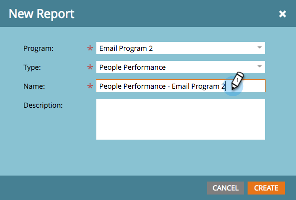

# Creare un rapporto in un programma {#create-a-report-in-a-program}

Esegui un rapporto per analizzare le persone, i programmi, le pagine di destinazione, le e-mail e le risorse social.

1. Passa a **[!UICONTROL Marketing Activities]**.

   

1. Seleziona un programma.

   

   >[!NOTE]
   >
   >È inoltre possibile creare report dalla scheda **[!UICONTROL Analytics]**.

1. Fare clic con il pulsante destro del mouse sul programma e selezionare **[!UICONTROL New Local Asset]**.

   

1. Fai clic su **[!UICONTROL Report]**.

   

1. Selezionare il report **[!UICONTROL Type]**.

   

   >[!TIP]
   >
   >Per una breve descrizione di ciascuno di essi, vedere [Panoramica del tipo di report](https://docs.marketo.com/display/DOCS/Report+Type+Overview).

1. Assegna un nome al rapporto.

   

   >[!TIP]
   >
   >Per semplificare ulteriormente la navigazione nei rapporti, includi nel nome un riferimento al tipo di rapporto.

1. Imposta l’intervallo di tempo del rapporto. Per ulteriori dettagli, consulta [Modificare un intervallo di tempo del report](/help/marketo/product-docs/reporting/basic-reporting/editing-reports/change-a-report-time-frame.md).

1. Fare clic sulla scheda **[!UICONTROL Report]** per visualizzare le statistiche.

   

   >[!NOTE]
   >
   >Per impostazione predefinita, i rapporti coprono tutte le attività nel tuo account, tra programmi diversi.

   >[!NOTE]
   >
   >Puoi finire rapidamente con un sacco di rapporti. Ricorda di [eliminare un report](/help/marketo/product-docs/reporting/basic-reporting/report-activity/delete-a-report.md) non più necessario.

   >[!MORELIKETHIS]
   >
   >È possibile [modificare un intervallo di tempo del report](/help/marketo/product-docs/reporting/basic-reporting/editing-reports/change-a-report-time-frame.md), [sottoscrivere un report di base](/help/marketo/product-docs/reporting/basic-reporting/report-subscriptions/subscribe-to-a-basic-report.md), [esportare un report in Excel](/help/marketo/product-docs/reporting/basic-reporting/report-activity/export-a-report-to-excel.md), [filtrare le persone in un report con un elenco avanzato](/help/marketo/product-docs/reporting/basic-reporting/editing-reports/filter-people-in-a-report-with-a-smart-list.md) e altro ancora.
