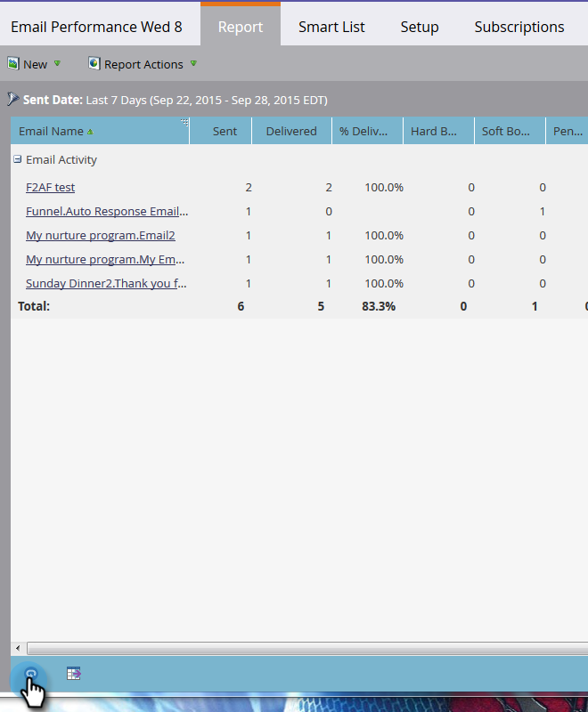

# Aggiornare un rapporto {#refresh-a-report}

Dopo aver visualizzato un report, Marketo lo memorizza nel database in modo che venga caricato rapidamente al momento della visualizzazione successiva. Dopo la prima visualizzazione, i rapporti vengono aggiornati automaticamente ogni 24 ore, in modo da essere sempre aggiornati. ma puoi aggiornarli manualmente in qualsiasi momento.

1. Per vedere quando è stato aggiornato l’ultimo rapporto, passa il cursore sull’icona a forma di freccia circolare nell’angolo in basso a sinistra.

   

1. L&#39;icona a forma di freccia circolare è il pulsante di aggiornamento. Fai clic su di esso per ottenere i risultati più recenti.

   

1. È inoltre possibile aggiornare il report facendo clic sul menu **[!UICONTROL Report Actions]** e selezionando **[!UICONTROL Refresh Report]**.

   

   Voilà!
