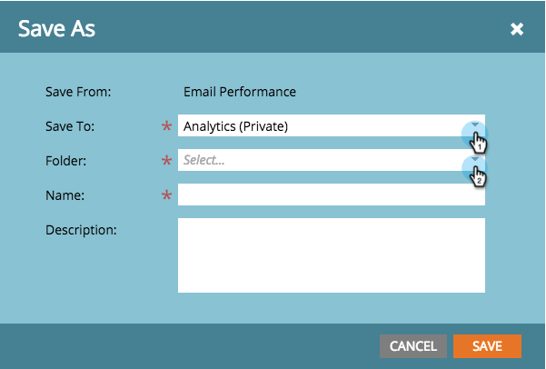

# Salvare un rapporto {#save-a-report}

A volte può essere necessario salvare un rapporto predefinito per visualizzarlo nuovamente in un secondo momento. Ecco come farlo:

1. Passa alla schermata **[!UICONTROL Analytics]**.

   

1. Selezionare un tipo di report [&#128279;](/help/marketo/product-docs/reporting/basic-reporting/report-types/report-type-overview.md).

   

1. Fare clic su **[!UICONTROL Report Actions]** e selezionare **[!UICONTROL Save As]**.

   

1. **[!UICONTROL Save To]** una posizione e selezionare **[!UICONTROL Folder]**.

   

1. **[!UICONTROL Name]** il report e fare clic su **[!UICONTROL Save]**.

   

   Fantastico! Il report salvato verrà ora visualizzato nella struttura.

   

>[!MORELIKETHIS]
>
>Scopri come [clonare un report per raggruppare i report](/help/marketo/product-docs/reporting/basic-reporting/report-activity/clone-a-report-to-group-reports.md).
