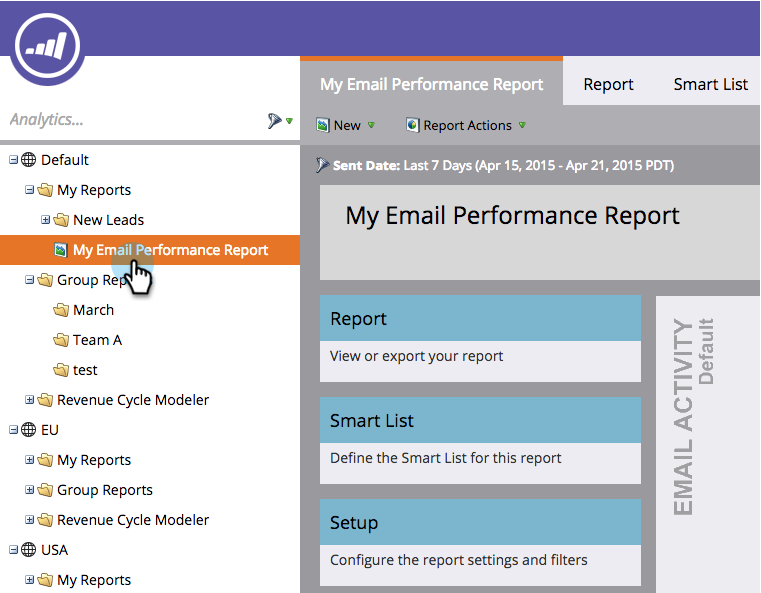

# Salva un report {#save-a-report}

A volte può essere necessario salvare un rapporto predefinito per visualizzarlo di nuovo in seguito. Ecco come farlo:

1. Andate all&#39;area **Analytics**.

   

1. Selezionare un [tipo di report](/help/marketo/product-docs/reporting/basic-reporting/report-types/report-type-overview.md).

   

1. Fare clic su **Azioni report** e selezionare **Salva con nome**.

   

1. **Salva** in un percorso e seleziona una  **cartella**.

   

1. **Denominate** il rapporto e fate clic su  **Salva**.

   

   Fantastico! Il rapporto salvato verrà ora visualizzato nella struttura ad albero.

   

>[!MORELIKETHIS]
>
>Scopri come [duplicare un report per raggruppare i report](/help/marketo/product-docs/reporting/basic-reporting/report-activity/clone-a-report-to-group-reports.md).
