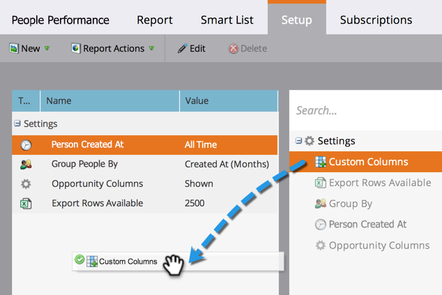

# Aggiungere colonne personalizzate a un rapporto Persona {#add-custom-columns-to-a-person-report}

Puoi filtrare ulteriormente le metriche nei report sulle persone utilizzando i tuoi [elenchi avanzati](/help/marketo/product-docs/core-marketo-concepts/smart-lists-and-static-lists/understanding-smart-lists.md) come colonne personalizzate.

1. Passare all&#39;area **[!UICONTROL Marketing Activities]** (o **[!UICONTROL Analytics]**).

   

1. Selezionare il report e fare clic sulla scheda **[!UICONTROL Setup]**.

   

1. Trascinare su **[!UICONTROL Custom Columns]**.

   

1. Selezionare gli elenchi smart da utilizzare come colonne di report.

   

1. Ce l&#39;hai fatta! Fare clic sulla scheda **[!UICONTROL Report]** per visualizzare il report con le nuove colonne.

   

   >[!MORELIKETHIS]
   >
   >È inoltre possibile [Aggiungere colonne di opportunità a un report lead](/help/marketo/product-docs/reporting/basic-reporting/editing-reports/add-opportunity-columns-to-a-lead-report.md).
