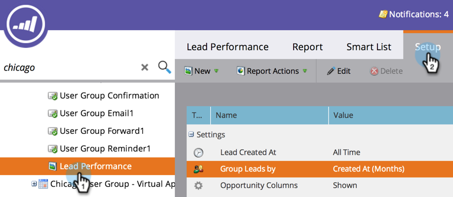

# Configurare le dimensioni del rapporto {#configure-report-size}

Per impostazione predefinita, i rapporti di Marketo sono limitati a un massimo di 5.000 righe, ma puoi modificare tale limite.

1. Passa alla schermata **[!UICONTROL Marketing Activities]**.

   

1. Selezionare il report dalla struttura di navigazione e fare clic sulla scheda **[!UICONTROL Setup]**.

   

1. Fare doppio clic su **[!UICONTROL Export Rows Available]**.

   

1. Seleziona il nuovo limite.

   

   >[!TIP]
   >
   >La modifica del limite cambia la dimensione del report stesso, non solo il file [!DNL Excel] esportato, quindi se la generazione del report richiede troppo tempo, riduci il limite!

1. Fare clic su **[!UICONTROL Save]** per confermare il nuovo limite.

   

   Hai finito! Il rapporto rispetterà il nuovo limite.

   >[!MORELIKETHIS]
   >
   >Puoi [esportare il tuo report](/help/marketo/product-docs/reporting/basic-reporting/report-activity/export-a-report-to-excel.md) con il nuovo limite.
